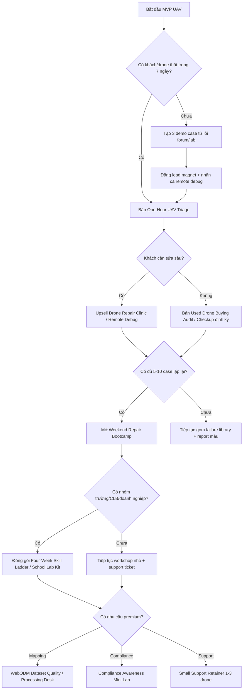

# Brainstorming Session Results

**Facilitator:** ThanhTu
**Date:** 2026-05-02

## Session Overview

**Topic:** TOP 10 repo GitHub tốt nhất cho mô phỏng, thiết kế, lắp đặt và thử nghiệm drone/UAV theo tiêu chí dễ triển khai, dễ kiếm tiền, dễ dạy, dễ sửa.

**Goals:** Tạo brainstorming thực dụng cho cá nhân khởi nghiệp, dạy học và sửa chữa drone. Repo được chọn không phải vì "xịn nhất" về nghiên cứu, mà vì có thể nhanh chóng biến thành khóa học, dịch vụ sửa chữa, lab mô phỏng, quy trình lắp đặt, thử nghiệm và gói dịch vụ UAV nhỏ.

### Context Guidance

Mô hình ưu tiên đã chốt trong Product Brief: sửa chữa + đào tạo thực hành là mũi nhọn MVP; WebODM/mapping là gói nâng cấp/premium. Stack trọng tâm gồm ArduPilot, Mission Planner, QGroundControl, Betaflight, INAV, WebODM và các công cụ liên quan.

### Session Setup

Buổi brainstorming sẽ đánh giá repo theo lăng kính thực dụng: thời gian triển khai, khả năng tạo doanh thu, độ dễ dạy, mức liên quan tới sửa chữa, giá trị mô phỏng/thử nghiệm, cộng đồng hỗ trợ, và khả năng tạo case study cho lớp học hoặc dịch vụ.

## Technique Selection

**Approach:** Progressive Technique Flow
**Journey Design:** Đi từ mở rộng ý tưởng, nhận diện mẫu, phát triển gói ứng dụng, rồi chốt kế hoạch triển khai.

**Progressive Techniques:**

- **Phase 1 - Exploration:** Cross-Pollination để mượn góc nhìn từ sửa chữa điện tử, đào tạo nghề, lab mô phỏng, dịch vụ mapping và dịch vụ kỹ thuật tại hiện trường.
- **Phase 2 - Pattern Recognition:** Solution Matrix để so sánh repo theo các tiêu chí dễ cài, dễ dạy, dễ sửa, dễ demo, dễ biến thành dịch vụ, cộng đồng mạnh và khả năng tạo doanh thu gần.
- **Phase 3 - Development:** SCAMPER Method để biến repo mạnh thành khóa học, bài lab, checklist lắp đặt, dịch vụ sửa chữa, gói mapping, workshop hoặc sản phẩm số.
- **Phase 4 - Action Planning:** Decision Tree Mapping để chốt repo nào học trước, dạy trước, kiếm tiền trước và repo nào để làm premium.

**Journey Rationale:** Vì mục tiêu của phiên là chọn repo không chỉ "xịn" mà còn dùng được ngay cho khởi nghiệp nhỏ, đào tạo thực hành và sửa chữa drone, flow này ưu tiên tạo nhiều lựa chọn trước, sau đó lọc bằng tiêu chí thương mại và khả năng triển khai.

## Technique Execution Results

### Phase 1 - Cross-Pollination: Forum + Government Lens

**Interactive Focus:** ThanhTu muốn tham khảo từ các diễn đàn UAV và nguồn chính phủ/quản lý bay. Vì vậy, các repo sẽ được nhìn qua hai lớp bằng chứng:

- **Forum signal:** lỗi người dùng gặp thật, câu hỏi lặp lại, nhu cầu hỗ trợ, khả năng biến thành bài lab/sửa chữa/dịch vụ.
- **Government signal:** yêu cầu đăng ký, điều kiện khai thác, vùng cấm/hạn chế bay, Remote ID, LAANC/airspace authorization, geo-awareness, an toàn hàng không.

**Source Direction:** Ưu tiên diễn đàn/cộng đồng ArduPilot, PX4, QGroundControl, OpenDroneMap/WebODM, Betaflight/INAV; ưu tiên nguồn chính thức như Cục Hàng không Việt Nam, FAA, EASA/CAA khi biến repo thành giáo trình hoặc dịch vụ.

#### Đợt Ý Tưởng 1 - Forum + Government Seed

**[Forum+Gov #1]: Repo Có Dấu Chân Lỗi**  
_Concept_: Xếp hạng repo theo số loại lỗi thực tế mà người dùng hay gặp trên forum: không nhận flight controller, lỗi driver, lỗi firmware, lỗi calibration, lỗi log. Repo càng giúp chẩn đoán lỗi càng đáng đưa vào TOP 10.  
_Novelty_: Không chọn repo vì nổi tiếng, mà vì nó tạo được dịch vụ sửa chữa.

**[Forum+Gov #2]: Lab Không Được Bay Vẫn Học Được**  
_Concept_: Dùng PX4/Gazebo/QGroundControl hoặc ArduPilot SITL để tạo khóa học mô phỏng trước khi bay thật. Gắn bài học với vùng cấm bay, hạn chế bay, Remote ID và quy trình xin phép.  
_Novelty_: Biến ràng buộc pháp lý thành lợi thế đào tạo.

**[Forum+Gov #3]: Gói Dịch Vụ Kiểm Tra Trước Khi Bay**  
_Concept_: Từ yêu cầu an toàn, đăng ký và điều kiện khai thác, tạo checklist kỹ thuật gồm firmware, GPS, failsafe, pin, log, Remote ID và khu vực bay. Repo phù hợp gồm ArduPilot, Mission Planner, QGroundControl và MAVProxy.  
_Novelty_: Repo trở thành công cụ bán dịch vụ kiểm định nhẹ.

**[Forum+Gov #4]: WebODM Như Dịch Vụ Hậu Kỳ Bay**  
_Concept_: Cộng đồng OpenDroneMap/WebODM có nhiều lỗi xử lý ảnh, thiếu ảnh, cấu hình máy, RAM/GPU. Đây là cơ hội dạy "bay đúng để xử lý ảnh đúng", rồi bán dịch vụ mapping hoặc xử lý dữ liệu.  
_Novelty_: Không chỉ dạy phần mềm, mà dạy cả quy trình bay tạo dữ liệu sạch.

**[Forum+Gov #5]: Remote ID Mini Lab**  
_Concept_: Đưa OpenDroneID/ArduRemoteID vào danh sách ứng viên để dạy nhận dạng UAV, compliance và kiểm tra tín hiệu Remote ID.  
_Novelty_: Đây là mảng ít người dạy ở mức thực hành, nhưng đang được chính phủ nhiều nước đẩy mạnh.

#### Đợt Ý Tưởng 2 - Forum/Community Cross-Pollination

**[Forum #6]: USB/COM Driver Clinic**  
_Concept_: Biến lỗi "không nhận flight controller" trong Mission Planner/QGroundControl thành một lab dịch vụ: kiểm cáp, driver, COM port, bootloader, firmware tab, Windows Device Manager. Repo/công cụ ứng viên gồm QGroundControl, Mission Planner, ArduPilot firmware tools và PX4 tooling.  
_Novelty_: Đây là bài học rất đời thường nhưng có khả năng kiếm tiền nhanh vì người mới kẹt ngay từ bước cắm board.

**[Forum #7]: Firmware Rescue Bench**  
_Concept_: Tạo một bench thực hành cứu firmware: flash nhầm PX4/ArduPilot, board bị kẹt bootloader, firmware không hiện trong QGC, hoặc cần quay về stack ổn định. Mỗi ca forum trở thành một kịch bản phục hồi có checklist trước/sau.  
_Novelty_: Không dạy firmware như lý thuyết, mà dạy như nghề sửa: cứu board trước, giải thích kiến thức sau.

**[Forum #8]: Log Doctor Service**  
_Concept_: Dùng MAVProxy/MAVExplorer để đọc telemetry log và DataFlash log, tạo dịch vụ chẩn đoán sau bay: rung, compass, GPS, failsafe, attitude control, pin tụt áp. Khóa học có thể bắt đầu bằng "gửi log, nhận bệnh án".  
_Novelty_: Repo không chỉ để bay, mà trở thành máy X-quang cho drone.

**[Forum #9]: FPV Blackbox Tune Lab**  
_Concept_: Dựa trên các lỗi Betaflight/Blackbox như log hỏng, gyro noise, OSD mất khi bật logging, tạo lab tune FPV và đọc blackbox. Repo ứng viên gồm Betaflight, Blackbox Log Viewer và các firmware target liên quan.  
_Novelty_: FPV có cộng đồng đông, lỗi nhiều, học viên dễ thấy kết quả qua video và log.

**[Forum #10]: WebODM Error Cookbook**  
_Concept_: Thu thập lỗi WebODM/ODM thường gặp như thiếu ảnh, stitch lỗi, cấu hình Docker, RAM/GPU, dataset quá nặng, rồi biến thành cookbook tiếng Việt. Mỗi lỗi đi kèm nguyên nhân bay, nguyên nhân máy tính và cách xử lý.  
_Novelty_: Bán "bớt đau đầu" thay vì bán phần mềm.

**[Forum #11]: Hardware Compatibility Matrix**  
_Concept_: Tạo ma trận tương thích board - firmware - ground station - driver - hệ điều hành dựa trên câu hỏi lặp lại từ forum. Repo nào giúp test hoặc xác minh tương thích sẽ được điểm cao trong TOP 10.  
_Novelty_: Đây là tài sản dạy học lẫn tư vấn mua linh kiện, giúp tránh mua sai board.

**[Forum #12]: Forum-to-Checklist Content Engine**  
_Concept_: Mỗi câu hỏi lặp lại trên forum trở thành một checklist, video ngắn hoặc bài lab: "QGC không nhận board", "Mission Planner timeout", "WebODM không dùng hết ảnh", "Blackbox không parse log".  
_Novelty_: Cộng đồng tự cung cấp backlog nội dung đào tạo và dịch vụ.

**[Forum #13]: Second-Hand Drone Inspection Pack**  
_Concept_: Dựa trên các lỗi phần cứng cũ/không còn hỗ trợ như APM đời cũ, Pixhawk clone, FC lỗi cổng USB, tạo dịch vụ kiểm tra drone cũ trước khi mua. Repo/công cụ được chọn nếu hỗ trợ nhận diện firmware, log, sensor và trạng thái board.  
_Novelty_: Mở ra dịch vụ rất gần thị trường: kiểm định drone cũ cho người mới chơi hoặc lớp học.

**[Forum #14]: Simulation Bug Zoo**  
_Concept_: Xây một "vườn lỗi mô phỏng" cho PX4/ArduPilot SITL, Gazebo, QGroundControl: spawn sai vị trí, joystick không nhận, MAVLink không kết nối, GPS map lệch. Học viên sửa lỗi trong mô phỏng trước khi đụng drone thật.  
_Novelty_: Biến lỗi mô phỏng thành giáo cụ, giảm rủi ro hỏng phần cứng.

**[Forum #15]: Support Retainer for Drone Teams**  
_Concept_: Từ nhu cầu hỗ trợ lặp lại trên forum, đóng gói dịch vụ hỗ trợ theo tháng cho đội mapping, trường học hoặc shop sửa: cài WebODM, đọc log ArduPilot, xử lý QGC/Mission Planner, tư vấn firmware.  
_Novelty_: Repo mã nguồn mở trở thành nền cho dịch vụ hỗ trợ liên tục, không phụ thuộc vào bán phần cứng.

### TOP 10 Repo Ứng Viên v0.1

**Selection Lens:** Danh sách này không xếp theo số sao thuần túy. Ưu tiên repo có thể biến thành giáo trình, dịch vụ sửa chữa, lab mô phỏng, quy trình lắp đặt/thử nghiệm, gói mapping hoặc compliance lab.

| Rank | Repo | Vai trò chính | Lý do đưa vào TOP 10 ứng viên | Gói có thể bán/dạy |
| --- | --- | --- | --- | --- |
| 1 | [ArduPilot/ardupilot](https://github.com/ArduPilot/ardupilot) | Autopilot lõi | Hệ sinh thái rất lớn, nhiều vehicle, nhiều ca lỗi/log/forum, mạnh cho sửa chữa và đào tạo thực hành. | Khóa ArduPilot căn bản, lab SITL, dịch vụ cấu hình/check lỗi bay. |
| 2 | [ArduPilot/MissionPlanner](https://github.com/ArduPilot/MissionPlanner) | Ground control Windows | Rất thực dụng cho setup, calibration, firmware, mission, lỗi kết nối và dịch vụ tại shop. | Gói cài đặt Mission Planner, checklist cấu hình Pixhawk, lớp sửa lỗi kết nối. |
| 3 | [mavlink/qgroundcontrol](https://github.com/mavlink/qgroundcontrol) | Ground control đa nền tảng | Cầu nối PX4/ArduPilot, phù hợp lab setup, firmware, mission planning và lỗi USB/COM. | Workshop QGC, lab firmware rescue, quy trình setup ban đầu. |
| 4 | [PX4/PX4-Autopilot](https://github.com/PX4/PX4-Autopilot) | Autopilot + simulation | Mạnh về mô phỏng, developer workflow, Gazebo, MAVSDK, phù hợp dạy trước khi bay thật. | Lab PX4/Gazebo, khóa mô phỏng UAV, testbed R&D. |
| 5 | [WebODM/WebODM](https://github.com/WebODM/WebODM) | Giao diện xử lý ảnh aerial imagery | Dễ biến thành dịch vụ mapping vì có UI, dễ demo cho khách, nhiều lỗi thực tế để dạy xử lý. | Dịch vụ mapping, khóa WebODM, xử lý ảnh thuê. |
| 6 | [OpenDroneMap/ODM](https://github.com/OpenDroneMap/ODM) | Core photogrammetry CLI | Nền xử lý sâu cho orthomosaic, point cloud, 3D model, DEM; tốt cho lab nâng cao. | Gói xử lý dữ liệu nâng cao, tuning pipeline, dịch vụ hậu kỳ ảnh bay. |
| 7 | [ArduPilot/MAVProxy](https://github.com/ArduPilot/MAVProxy) | MAVLink proxy + CLI ground station | Nhỏ nhưng rất giá trị cho telemetry, log, replay, test kết nối và chẩn đoán kỹ thuật. | Log Doctor, khóa đọc telemetry, dịch vụ debug từ xa. |
| 8 | [betaflight/betaflight](https://github.com/betaflight/betaflight) | Firmware FPV | Cộng đồng đông, lỗi/tune nhiều, dễ tạo dịch vụ sửa và tối ưu drone FPV. | FPV setup/tune, sửa firmware, lớp Betaflight căn bản. |
| 9 | [iNavFlight/inav](https://github.com/iNavFlight/inav) | Firmware navigation-enabled | Hợp với fixed-wing, long range, RTH/navigation; bổ sung mảng ngoài FPV freestyle và ArduPilot. | Khóa fixed-wing INAV, dịch vụ cấu hình RTH/GPS, tư vấn build. |
| 10 | [opendroneid/opendroneid-core-c](https://github.com/opendroneid/opendroneid-core-c) | Remote ID core library | Kết nối trực tiếp với xu hướng quản lý bay, Remote ID, broadcast qua Wi-Fi/Bluetooth, compliance lab. | Remote ID mini lab, khóa nhận dạng UAV, tư vấn compliance/premium. |

**Parking Lot - Có thể kéo vào TOP 10 sau khi chấm ma trận:** [ArduPilot/pymavlink](https://github.com/ArduPilot/pymavlink), [betaflight/blackbox-log-viewer](https://github.com/betaflight/blackbox-log-viewer), [ArduPilot/ArduRemoteID](https://github.com/ArduPilot/ArduRemoteID).

### Phase 2 - Solution Matrix v0.1

**Technique:** Solution Matrix  
**Goal:** Nhận diện pattern trong TOP 10 repo ứng viên, không chỉ xếp hạng theo độ nổi tiếng.  
**Scoring:** 1 = yếu/khó dùng ngay, 5 = rất mạnh/dễ biến thành giá trị thực tế.  

**Weights:**

- **Dễ triển khai/demo:** 15
- **Dễ kiếm tiền gần:** 20
- **Dễ dạy:** 15
- **Dễ sửa/chẩn đoán:** 20
- **Mô phỏng/thử nghiệm:** 15
- **Forum + government signal:** 15

| Rank | Repo | Triển khai | Kiếm tiền | Dạy học | Sửa/chẩn đoán | Mô phỏng/test | Forum/Gov | Weighted Score | Pattern |
| --- | --- | ---: | ---: | ---: | ---: | ---: | ---: | ---: | --- |
| 1 | ArduPilot/ardupilot | 3 | 5 | 5 | 5 | 5 | 5 | 94 | Xương sống kỹ thuật cho sửa chữa, lab, log, SITL. |
| 2 | ArduPilot/MissionPlanner | 4 | 5 | 5 | 5 | 3 | 5 | 91 | Công cụ shop/service gần tiền nhất cho ArduPilot. |
| 3 | mavlink/qgroundcontrol | 4 | 4 | 5 | 4 | 4 | 5 | 86 | Ground control đa nền tảng, tốt cho setup và lỗi kết nối. |
| 4 | betaflight/betaflight | 4 | 5 | 4 | 5 | 2 | 5 | 85 | Cửa vào FPV, tune và sửa lỗi nhanh. |
| 5 | PX4/PX4-Autopilot | 3 | 4 | 4 | 3 | 5 | 5 | 79 | Mạnh cho mô phỏng, R&D, lab trước khi bay thật. |
| 6 | ArduPilot/MAVProxy | 3 | 4 | 3 | 5 | 4 | 4 | 78 | Tool chẩn đoán/log/telemetry, hợp dịch vụ debug sâu. |
| 7 | WebODM/WebODM | 3 | 5 | 5 | 3 | 2 | 4 | 74 | Mapping dễ bán và dễ demo, nhưng là nhánh premium. |
| 8 | iNavFlight/inav | 3 | 3 | 4 | 4 | 2 | 4 | 67 | Tốt cho fixed-wing, RTH/GPS, bổ sung mảng long range. |
| 9 | OpenDroneMap/ODM | 2 | 4 | 3 | 2 | 2 | 4 | 57 | Core xử lý ảnh mạnh, nhưng khó hơn WebODM cho MVP. |
| 10 | opendroneid/opendroneid-core-c | 2 | 3 | 3 | 2 | 2 | 5 | 56 | Compliance/Remote ID rất chiến lược, nên để premium lab. |

#### Pattern Recognition

**Pattern 1 - MVP sửa chữa + đào tạo nên bắt đầu từ ArduPilot stack:** ArduPilot, Mission Planner, QGroundControl và MAVProxy tạo thành chuỗi thực dụng từ firmware/setup đến log/debug. Đây là cụm gần nhất với mô hình "sửa chữa + đào tạo thực hành".

**Pattern 2 - Betaflight là đường kiếm tiền nhanh ở FPV:** Điểm mạnh nằm ở lỗi thật, cộng đồng đông, nhu cầu tune/sửa cao và kết quả dễ trình diễn. Đây là repo nên có trong khóa nhập môn hoặc dịch vụ shop.

**Pattern 3 - PX4 mạnh cho lab mô phỏng, không phải mũi kiếm tiền đầu tiên:** PX4 rất đáng dạy nếu muốn tạo hình ảnh chuyên nghiệp/R&D, nhưng độ gần tiền với shop sửa nhỏ thấp hơn ArduPilot/MissionPlanner/Betaflight.

**Pattern 4 - WebODM/ODM là nhánh premium mapping:** WebODM dễ bán hơn ODM vì có UI và dễ demo cho khách. ODM nên dùng khi đi sâu vào pipeline/hậu kỳ ảnh.

**Pattern 5 - OpenDroneID là quân bài tương lai:** Điểm hiện tại chưa cao vì khó triển khai với người mới, nhưng liên quan trực tiếp đến xu hướng Remote ID/compliance nên nên giữ làm module nâng cao.

#### Current Matrix Decision

**TOP 5 để triển khai trước:** ArduPilot/ardupilot, MissionPlanner, QGroundControl, Betaflight, MAVProxy.  
**TOP 3 để làm lab nâng cao/premium:** PX4, WebODM, OpenDroneMap/ODM.  
**Module chuyên biệt:** INAV cho fixed-wing/long-range; OpenDroneID cho compliance/Remote ID.

#### Parking Lot Scoring

| Repo | Triển khai | Kiếm tiền | Dạy học | Sửa/chẩn đoán | Mô phỏng/test | Forum/Gov | Weighted Score | Matrix Decision |
| --- | ---: | ---: | ---: | ---: | ---: | ---: | ---: | --- |
| [ArduPilot/pymavlink](https://github.com/ArduPilot/pymavlink) | 3 | 4 | 3 | 5 | 4 | 4 | 78 | Nên kéo vào nhóm công cụ kỹ thuật, nhưng dạy sau MAVProxy. |
| [betaflight/blackbox-log-viewer](https://github.com/betaflight/blackbox-log-viewer) | 4 | 4 | 5 | 5 | 2 | 4 | 80 | Nên kéo vào TOP thực dụng nếu ưu tiên FPV/tune/sửa. |
| [ArduPilot/ArduRemoteID](https://github.com/ArduPilot/ArduRemoteID) | 2 | 3 | 3 | 2 | 3 | 5 | 59 | Giữ ở module premium/compliance, chưa phải MVP. |

#### Updated Pattern After Parking Lot

**Blackbox Log Viewer có khả năng vượt INAV/OpenDroneID trong MVP:** Nếu mục tiêu gần là sửa FPV, tune drone, tạo bài lab dễ thấy kết quả, Blackbox Log Viewer nên đi cùng Betaflight như một cặp, không nên chỉ để parking lot.

**pymavlink mạnh nhưng nên đóng vai trò backend/tooling:** Nó rất có giá trị cho script kiểm tra, tự động hóa log, test MAVLink và xây công cụ chẩn đoán riêng. Tuy nhiên với học viên mới, MAVProxy dễ vào hơn.

**ArduRemoteID không thay thế OpenDroneID core ở giai đoạn chiến lược:** ArduRemoteID hữu ích nếu làm phần cứng ESP32 Remote ID với ArduPilot, nhưng nên để sau khi đã dạy xong nền tảng ArduPilot và compliance.

#### Updated TOP 10 Recommendation v0.2

| Rank | Repo | Decision |
| --- | --- | --- |
| 1 | ArduPilot/ardupilot | Giữ TOP 1, xương sống kỹ thuật. |
| 2 | ArduPilot/MissionPlanner | Giữ TOP 2, gần dịch vụ shop nhất. |
| 3 | mavlink/qgroundcontrol | Giữ TOP 3, setup đa nền tảng. |
| 4 | betaflight/betaflight | Giữ TOP 4, mảng FPV gần tiền. |
| 5 | betaflight/blackbox-log-viewer | Kéo vào TOP 5 vì tạo lab tune/sửa rất cụ thể. |
| 6 | ArduPilot/MAVProxy | Giữ TOP 6 cho log/telemetry/debug. |
| 7 | ArduPilot/pymavlink | Kéo vào TOP 7 như nền tự động hóa/chẩn đoán nâng cao. |
| 8 | PX4/PX4-Autopilot | Giữ cho mô phỏng/R&D, nhưng không phải mũi kiếm tiền đầu tiên. |
| 9 | WebODM/WebODM | Giữ cho mapping premium, dễ demo hơn ODM. |
| 10 | iNavFlight/inav | Giữ cho fixed-wing/long-range; có thể thay bằng OpenDroneID nếu ưu tiên compliance. |

**Repos temporarily moved out of TOP 10:** OpenDroneMap/ODM và opendroneid/opendroneid-core-c. Không loại bỏ, chỉ chuyển sang nhánh nâng cao: ODM cho xử lý ảnh sâu, OpenDroneID cho compliance/Remote ID.

### Phase 3 - SCAMPER Method: Kickoff

**Technique:** SCAMPER Method  
**Goal:** Biến TOP repo/cụm repo thành gói dịch vụ, khóa học, workshop, bài lab hoặc sản phẩm số có thể triển khai thực tế.  
**Target TOP 10 v0.2:** ArduPilot, Mission Planner, QGroundControl, Betaflight, Blackbox Log Viewer, MAVProxy, pymavlink, PX4, WebODM, INAV.

**SCAMPER Flow:**

- **S - Substitute:** Thay cách dạy/sửa truyền thống bằng cách nhanh hơn, thực chiến hơn.
- **C - Combine:** Ghép repo thành stack dịch vụ/khóa học.
- **A - Adapt:** Mượn mô hình từ ngành sửa điện thoại/laptop/ô tô/đào tạo nghề.
- **M - Modify:** Đổi format, mức độ, giá, đối tượng khách.
- **P - Put to Other Uses:** Dùng repo ngoài mục đích gốc để tạo dịch vụ mới.
- **E - Eliminate:** Bỏ phần khó, rườm rà, chưa kiếm tiền.
- **R - Reverse:** Đảo quy trình để tạo sản phẩm khác biệt.

#### S - Substitute: 4 Hướng Theo Thứ Tự Ưu Tiên

**[SCAMPER-S #16]: Drone Repair Clinic**  
_Concept_: Thay "khóa học drone tổng quát" bằng clinic sửa lỗi drone theo ca bệnh thật: không nhận flight controller, không arm, GPS lỗi, firmware sai, compass lệch, log rung, pin tụt áp. Stack chính gồm ArduPilot, Mission Planner, QGroundControl, Betaflight và MAVProxy.  
_Novelty_: Người học không bắt đầu bằng lý thuyết dài, mà bắt đầu bằng lỗi thật; mỗi lỗi sửa xong trở thành case study, video ngắn, checklist và dịch vụ thu phí.

**Gói sản phẩm/dịch vụ:**  
- **Tên gói:** Drone Repair Clinic - 10 lỗi phổ biến nhất  
- **Đối tượng:** người mới chơi, shop nhỏ, lớp nghề, đội UAV nội bộ  
- **Output:** checklist chẩn đoán, biên bản tình trạng drone, khuyến nghị sửa/cấu hình  
- **Repo/công cụ:** Mission Planner, QGroundControl, Betaflight, MAVProxy, ArduPilot  
- **Cách kiếm tiền:** phí kiểm tra theo ca, workshop cuối tuần, gói hỗ trợ từ xa

**[SCAMPER-S #17]: Log Diagnosis Bootcamp**  
_Concept_: Thay "dạy bay" bằng "dạy đọc log và chẩn đoán", dùng MAVProxy, pymavlink và Blackbox Log Viewer để hiểu drone đã làm gì trước/sau lỗi. Nội dung tập trung vào log rung, GPS glitch, compass variance, failsafe, throttle/pin, gyro noise và blackbox trace.  
_Novelty_: Kỹ năng đọc log hiếm hơn kỹ năng bay cơ bản; có thể bán như năng lực kỹ thuật cao cấp cho người sửa, giáo viên, đội bay và shop.

**Gói sản phẩm/dịch vụ:**  
- **Tên gói:** Log Doctor Bootcamp  
- **Đối tượng:** thợ sửa, giáo viên kỹ thuật, đội mapping/FPV, người đã biết bay nhưng chưa biết debug  
- **Output:** mẫu "bệnh án log", quy trình đọc log 15 phút, bộ dataset lỗi mẫu  
- **Repo/công cụ:** MAVProxy, pymavlink, Betaflight Blackbox Log Viewer, ArduPilot logs  
- **Cách kiếm tiền:** dịch vụ đọc log thuê, khóa nâng cao, gói support theo tháng

**[SCAMPER-S #18]: Simulation-First UAV Lab**  
_Concept_: Thay "lab phần cứng đắt tiền" bằng "mô phỏng trước, phần cứng sau", dùng ArduPilot SITL, PX4/Gazebo và QGroundControl để học mission, failsafe, parameter, telemetry và lỗi kết nối mà không làm hỏng drone. Sau khi học viên qua bài mô phỏng mới chuyển sang board thật.  
_Novelty_: Giảm chi phí hỏng hóc, giảm rủi ro pháp lý khi chưa được bay thật, và vẫn tạo cảm giác kỹ thuật chuyên nghiệp cho lớp học.

**Gói sản phẩm/dịch vụ:**  
- **Tên gói:** Simulation-First UAV Lab  
- **Đối tượng:** trường nghề, CLB kỹ thuật, người mới, đơn vị muốn đào tạo nội bộ  
- **Output:** lab 4 buổi, file mission mẫu, tình huống lỗi mô phỏng, checklist trước khi chuyển sang drone thật  
- **Repo/công cụ:** ArduPilot, PX4, QGroundControl, Gazebo/SITL  
- **Cách kiếm tiền:** khóa học nhập môn, setup lab cho trường/shop, bộ lab số bán kèm hướng dẫn

**[SCAMPER-S #19]: WebODM Post-Processing Desk**  
_Concept_: Thay "dịch vụ mapping hoàn chỉnh từ A-Z" bằng "bàn xử lý hậu kỳ ảnh bay", nơi khách gửi ảnh drone và nhận orthomosaic/point cloud/3D model cùng nhận xét lỗi dữ liệu. WebODM là lớp dễ dùng, ODM là lớp nâng cao khi cần tùy biến pipeline.  
_Novelty_: Không cần sở hữu đội bay ngay từ đầu; có thể kiếm tiền bằng năng lực xử lý dữ liệu, kiểm tra chất lượng ảnh và tư vấn cách bay lại cho đúng.

**Gói sản phẩm/dịch vụ:**  
- **Tên gói:** WebODM Post-Processing Desk  
- **Đối tượng:** đội bay nhỏ, người làm bất động sản/nông nghiệp/xây dựng, học viên đã có ảnh drone  
- **Output:** orthomosaic, report chất lượng ảnh, lỗi overlap/blur/GSD, đề xuất bay lại  
- **Repo/công cụ:** WebODM, OpenDroneMap/ODM  
- **Cách kiếm tiền:** xử lý ảnh theo dataset, khóa WebODM, gói tư vấn quy trình chụp ảnh mapping

#### Substitute Pattern

**Pattern:** Đổi trọng tâm từ "dạy drone như sở thích" sang "dạy drone như nghề kỹ thuật". Bốn hướng trên tạo một đường kiếm tiền tuần tự: sửa lỗi gần tiền nhất, đọc log tạo chuyên môn cao, mô phỏng giúp mở lớp an toàn, WebODM mở nhánh premium cho khách có dữ liệu bay.

#### C - Combine: Ghép Repo Thành Stack Bán Được

**[SCAMPER-C #20]: ArduPilot Service Stack**  
_Concept_: Ghép ArduPilot + Mission Planner + QGroundControl + MAVProxy + pymavlink thành một stack dịch vụ sửa chữa/đào tạo thực hành. Người học đi từ setup firmware, calibration, failsafe, mission, rồi đọc log và viết script kiểm tra đơn giản.  
_Novelty_: Thay vì dạy từng tool rời rạc, stack này mô phỏng đúng vòng đời một ca dịch vụ: nhận drone, kiểm tra, cấu hình, bay thử/mô phỏng, đọc log, bàn giao report.

**Gói có thể bán:**  
- **Tên gói:** ArduPilot Service Stack - từ setup đến report  
- **Sản phẩm:** khóa 4-6 buổi hoặc dịch vụ kiểm tra/cấu hình theo ca  
- **Output:** checklist setup, mẫu report kỹ thuật, bộ lỗi mẫu, script pymavlink cơ bản  
- **Doanh thu gần:** phí clinic, phí setup, khóa ngắn hạn, support từ xa

**[SCAMPER-C #21]: FPV Tune and Repair Stack**  
_Concept_: Ghép Betaflight + Blackbox Log Viewer thành stack tune/sửa FPV. Bài học xoay quanh firmware target, receiver, motor direction, gyro noise, PID/filter, blackbox log và kiểm tra sau sửa.  
_Novelty_: FPV có vòng phản hồi nhanh: chỉnh - bay - xem log/video - chỉnh lại. Điều này giúp học viên thấy kết quả ngay và shop có thể bán dịch vụ tune.

**Gói có thể bán:**  
- **Tên gói:** FPV Tune & Repair Weekend  
- **Sản phẩm:** workshop cuối tuần, dịch vụ tune theo drone, gói kiểm tra trước race/freestyle  
- **Output:** profile Betaflight mẫu, checklist blackbox, report tune trước/sau  
- **Doanh thu gần:** phí tune, phí workshop, bán kèm linh kiện/linh kiện thay thế

**[SCAMPER-C #22]: Simulation to Hardware Stack**  
_Concept_: Ghép ArduPilot SITL/PX4 + QGroundControl + Mission Planner thành stack "mô phỏng trước, phần cứng sau". Học viên luyện mission, failsafe, parameter, geofence, takeoff/landing logic trong mô phỏng trước khi đụng board thật.  
_Novelty_: Stack này giảm hỏng hóc và giúp đào tạo trong môi trường không được bay thật hoặc chưa xin phép bay.

**Gói có thể bán:**  
- **Tên gói:** Zero-Crash UAV Lab  
- **Sản phẩm:** lab cho trường/CLB/shop, bộ giáo trình mô phỏng 4 tuần  
- **Output:** mission mẫu, tình huống lỗi mô phỏng, checklist chuyển sang phần cứng thật  
- **Doanh thu gần:** setup lab, bán khóa nhập môn, licensing nội dung cho trường/CLB

**[SCAMPER-C #23]: Mapping Quality Stack**  
_Concept_: Ghép WebODM + ODM + QGroundControl/Mission Planner thành stack "bay đúng để xử lý ảnh đúng". Không chỉ xử lý ảnh, mà dạy thiết kế mission chụp, overlap, GSD, blur, chất lượng dataset và hậu kỳ orthomosaic/point cloud.  
_Novelty_: Nhiều người bán mapping nhưng ít người dạy liên kết giữa kế hoạch bay và lỗi xử lý ảnh; stack này biến lỗi WebODM thành tư vấn bay lại.

**Gói có thể bán:**  
- **Tên gói:** Mapping Quality Desk  
- **Sản phẩm:** xử lý dataset, report chất lượng ảnh, khóa WebODM thực hành  
- **Output:** orthomosaic, point cloud/3D model nếu phù hợp, checklist bay lại, report lỗi dữ liệu  
- **Doanh thu gần:** phí xử lý ảnh, phí tư vấn mission, khóa WebODM

**[SCAMPER-C #24]: Compliance-Aware Training Stack**  
_Concept_: Ghép OpenDroneID/ArduRemoteID với ArduPilot/PX4/QGroundControl để tạo module đào tạo nhận thức pháp lý: Remote ID, vùng bay, quy trình xin phép, pre-flight compliance checklist.  
_Novelty_: Không biến luật thành phần lý thuyết khô, mà đưa vào lab: trước khi bay/mô phỏng, học viên phải kiểm tra vùng bay, định danh, mục tiêu chuyến bay và điều kiện khai thác.

**Gói có thể bán:**  
- **Tên gói:** Safe & Compliant UAV Operations Mini Lab  
- **Sản phẩm:** module premium cho trường/đội bay/doanh nghiệp  
- **Output:** checklist compliance, lab Remote ID cơ bản, quy trình pre-flight theo bối cảnh Việt Nam + quốc tế  
- **Doanh thu gần:** chưa gần bằng sửa chữa, nhưng tăng uy tín và phù hợp khách tổ chức

#### Combine Pattern

**Pattern:** Repo nên được bán theo cụm, không bán theo tên repo. Cụm mạnh nhất cho MVP là **ArduPilot Service Stack** và **FPV Tune and Repair Stack** vì vừa dạy được, vừa sửa được, vừa có lỗi thật từ cộng đồng. Cụm **Simulation to Hardware** mở lớp an toàn; **Mapping Quality** và **Compliance-Aware** là nhánh premium.

#### A - Adapt: Mượn Mô Hình Từ Ngành Khác

**[SCAMPER-A #25]: Phone Repair Intake for Drones**  
_Concept_: Mượn quy trình nhận máy của tiệm sửa điện thoại: phiếu tiếp nhận, tình trạng ban đầu, lỗi khách mô tả, ảnh/video hiện trạng, test nhanh cổng USB/FC/GPS/pin, báo giá trước khi sửa. Áp vào Drone Repair Clinic và ArduPilot/Betaflight stack.  
_Novelty_: Làm dịch vụ drone có cảm giác chuyên nghiệp và tin cậy hơn, thay vì "anh cứ để em xem thử".

**Áp dụng:**  
- **Stack:** ArduPilot Service Stack, FPV Tune and Repair Stack  
- **Tài sản cần tạo:** phiếu tiếp nhận drone, checklist test 15 phút, mẫu báo giá, ảnh trước/sau  
- **Repo/công cụ:** Mission Planner, QGroundControl, Betaflight Configurator, MAVProxy  
- **Giá trị:** tăng niềm tin khách hàng, giảm tranh cãi, dễ biến thành bài học cho học viên

**[SCAMPER-A #26]: Laptop Diagnostic Report for UAV**  
_Concept_: Mượn mô hình báo cáo chẩn đoán laptop: CPU/RAM/SSD/nhiệt độ được thay bằng firmware, sensor, GPS, compass, vibration, battery, radio, log. Mỗi drone nhận một report kỹ thuật có điểm sức khỏe và khuyến nghị.  
_Novelty_: Biến sửa drone thành dịch vụ có bằng chứng, không chỉ lời nói; report có thể bán riêng như "khám tổng quát UAV".

**Áp dụng:**  
- **Stack:** ArduPilot Service Stack, Log Diagnosis Bootcamp  
- **Tài sản cần tạo:** mẫu UAV Health Report, thang điểm sensor/log, ảnh log minh họa, khuyến nghị sửa  
- **Repo/công cụ:** MAVProxy, pymavlink, Mission Planner logs, Blackbox Log Viewer  
- **Giá trị:** tạo sản phẩm số, chuẩn hóa đào tạo, dễ upsell sửa chữa hoặc khóa học

**[SCAMPER-A #27]: Auto Garage Preventive Maintenance**  
_Concept_: Mượn mô hình bảo dưỡng ô tô định kỳ: 1.000 km, 5.000 km, trước chuyến đi xa; chuyển thành "sau 20 chuyến bay", "trước dự án mapping", "sau crash", "trước mùa cao điểm".  
_Novelty_: Drone không chỉ sửa khi hỏng, mà có gói bảo dưỡng định kỳ tạo doanh thu lặp lại.

**Áp dụng:**  
- **Stack:** ArduPilot Service Stack, FPV Tune and Repair Stack, Mapping Quality Stack  
- **Tài sản cần tạo:** gói pre-flight, post-crash, pre-mapping, seasonal check  
- **Repo/công cụ:** Mission Planner, QGroundControl, Betaflight, WebODM report nếu có dữ liệu ảnh  
- **Giá trị:** biến dịch vụ một lần thành retainer/bảo dưỡng định kỳ

**[SCAMPER-A #28]: Vocational Competency Passport**  
_Concept_: Mượn mô hình sổ tay năng lực của đào tạo nghề: học viên không chỉ hoàn thành khóa, mà được tick từng năng lực như cài firmware, calibration, đọc log, xử lý lỗi QGC, tạo mission, xử lý WebODM dataset.  
_Novelty_: Khóa học trở thành chứng minh năng lực thực hành, dễ bán cho trường nghề/CLB/doanh nghiệp hơn chứng chỉ chung chung.

**Áp dụng:**  
- **Stack:** Simulation to Hardware Stack, ArduPilot Service Stack, Mapping Quality Stack  
- **Tài sản cần tạo:** UAV Skill Passport, rubric đánh giá, bài test thực hành, repo/lab theo từng năng lực  
- **Repo/công cụ:** ArduPilot SITL, PX4/Gazebo, QGroundControl, Mission Planner, WebODM  
- **Giá trị:** tăng chất lượng đào tạo, dễ đóng gói thành curriculum 4-8 tuần

**[SCAMPER-A #29]: Dental Checkup Subscription**  
_Concept_: Mượn mô hình nha khoa: kiểm tra định kỳ, làm sạch, phát hiện sớm vấn đề. Với UAV: kiểm tra sensor/log/firmware/pin/ốc/prop/motor định kỳ, tạo "UAV checkup" theo tháng/quý.  
_Novelty_: Dịch vụ không cần đợi drone hỏng mới có tiền; khách mua sự yên tâm trước chuyến bay hoặc dự án.

**Áp dụng:**  
- **Stack:** ArduPilot Service Stack, FPV Tune and Repair Stack  
- **Tài sản cần tạo:** gói Basic/Pro/Premium checkup, lịch nhắc kiểm tra, mẫu report trước/sau  
- **Repo/công cụ:** Mission Planner, Betaflight, MAVProxy, Blackbox Log Viewer  
- **Giá trị:** doanh thu lặp lại, phù hợp đội bay nhỏ/trường học/shop

**[SCAMPER-A #30]: Cloud Support SLA for Drone Teams**  
_Concept_: Mượn mô hình hỗ trợ cloud/SaaS: ticket, SLA, gói support theo tháng, knowledge base, incident report. Áp vào đội bay mapping, trường học hoặc shop cần hỗ trợ WebODM/log/QGC/Mission Planner.  
_Novelty_: Open-source repo trở thành nền cho dịch vụ hỗ trợ liên tục, không phụ thuộc vào bán phần cứng.

**Áp dụng:**  
- **Stack:** ArduPilot Service Stack, Mapping Quality Stack, Compliance-Aware Training Stack  
- **Tài sản cần tạo:** form ticket, SLA 24-48h, knowledge base lỗi thường gặp, report incident  
- **Repo/công cụ:** WebODM, MAVProxy, QGroundControl, Mission Planner, OpenDroneID nếu có compliance  
- **Giá trị:** tạo dòng tiền tháng, gom dữ liệu lỗi thật để cải thiện khóa học

#### Adapt Pattern

**Pattern:** Nên bán UAV như một nghề dịch vụ kỹ thuật có quy trình, report và bảo trì định kỳ. Mô hình tốt nhất để copy là **tiệm sửa điện thoại/laptop** cho intake + diagnostic, **garage ô tô/nha khoa** cho bảo dưỡng định kỳ, và **SaaS support** cho retainer.

#### M - Modify: Chỉnh Format, Giá, Đối Tượng Và Mức Độ

**[SCAMPER-M #31]: One-Hour UAV Triage**  
_Concept_: Thu nhỏ Drone Repair Clinic thành gói kiểm tra 60 phút: nhận tình trạng, kiểm kết nối, firmware, sensor cơ bản, pin, log nếu có, rồi trả một report ngắn "sửa ngay / cần linh kiện / cần debug sâu".  
_Novelty_: Gói cực nhỏ, dễ bán cho người mới vì không bắt họ cam kết khóa học dài hay sửa lớn ngay.

**Format đề xuất:**  
- **Đối tượng:** người mới, người mua drone cũ, shop nhỏ  
- **Giá tham chiếu:** thấp/trung bình, tính theo ca  
- **Deliverable:** report 1 trang + checklist lỗi + đề xuất bước tiếp theo  
- **Stack:** Mission Planner, QGroundControl, Betaflight, MAVProxy nếu có log

**[SCAMPER-M #32]: Weekend Repair Bootcamp**  
_Concept_: Đóng gói ArduPilot/Betaflight service stack thành workshop 2 ngày: ngày 1 lỗi setup/cấu hình, ngày 2 đọc log/tune/case thực tế. Người học mang drone hoặc dùng case mẫu.  
_Novelty_: Đủ ngắn để bán dễ, đủ sâu để tạo cảm giác nghề nghiệp, và dễ quay thành nội dung.

**Format đề xuất:**  
- **Đối tượng:** người chơi nghiêm túc, thợ sửa, CLB kỹ thuật  
- **Giá tham chiếu:** trung bình/cao theo nhóm nhỏ  
- **Deliverable:** checklist sửa lỗi, certificate of practical completion, dataset log mẫu  
- **Stack:** ArduPilot, Mission Planner, Betaflight, Blackbox Log Viewer, MAVProxy

**[SCAMPER-M #33]: Four-Week Skill Ladder**  
_Concept_: Chuyển "khóa UAV tổng quát" thành lộ trình 4 tuần, mỗi tuần một năng lực: setup/cấu hình, mô phỏng, đọc log/sửa lỗi, mapping hoặc FPV tune tùy nhánh.  
_Novelty_: Lộ trình ngắn nhưng có cấp bậc rõ, phù hợp bán cho người mới và trường/CLB.

**Format đề xuất:**  
- **Tuần 1:** Ground station + firmware + calibration  
- **Tuần 2:** SITL/mô phỏng + mission + failsafe  
- **Tuần 3:** log diagnosis + repair workflow  
- **Tuần 4:** nhánh chọn: FPV tune hoặc WebODM mapping  
- **Deliverable:** UAV Skill Passport + 4 bài lab + final practical test

**[SCAMPER-M #34]: Basic Pro Premium Service Ladder**  
_Concept_: Chỉnh dịch vụ thành 3 tầng: Basic kiểm nhanh, Pro sửa/cấu hình/log, Premium mapping/compliance/support. Tầng thấp giúp khách vào dễ, tầng cao giúp tăng doanh thu.  
_Novelty_: Tránh bán một gói "tất cả trong một" khó chốt; khách có đường nâng cấp tự nhiên.

**Format đề xuất:**  
- **Basic:** One-Hour Triage, report tình trạng  
- **Pro:** sửa/cấu hình + đọc log + test sau sửa  
- **Premium:** WebODM processing, compliance checklist, support theo tháng  
- **Stack:** Basic dùng QGC/Mission Planner/Betaflight; Pro thêm MAVProxy/Blackbox; Premium thêm WebODM/OpenDroneID

**[SCAMPER-M #35]: Remote Debug Package**  
_Concept_: Biến hỗ trợ kỹ thuật thành gói từ xa: khách gửi video, ảnh wiring, file log, ảnh lỗi QGC/Mission Planner/WebODM; mình trả lại report và hướng dẫn từng bước.  
_Novelty_: Không cần nhận drone vật lý ngay, mở rộng thị trường ngoài địa phương và tạo nguồn dữ liệu lỗi thật.

**Format đề xuất:**  
- **Đối tượng:** đội bay tỉnh xa, học viên online, shop cần ý kiến thứ hai  
- **Giá tham chiếu:** theo ticket hoặc theo tháng  
- **Deliverable:** report PDF, checklist hành động, video call nếu cần  
- **Stack:** MAVProxy, pymavlink, QGroundControl, Mission Planner, WebODM, Blackbox Log Viewer

**[SCAMPER-M #36]: School Lab Kit**  
_Concept_: Chỉnh Simulation-First UAV Lab thành bộ lab cho trường/CLB: không cần nhiều drone thật, dùng SITL/PX4/Gazebo/QGC để dạy nền tảng, sau đó chỉ cần vài bộ phần cứng để kiểm chứng.  
_Novelty_: Giải quyết rào cản ngân sách và rủi ro hỏng thiết bị trong môi trường đào tạo.

**Format đề xuất:**  
- **Đối tượng:** trường nghề, đại học, CLB STEM/UAV  
- **Deliverable:** giáo án 4-8 buổi, file mission, case lỗi mô phỏng, rubric chấm điểm  
- **Stack:** ArduPilot SITL, PX4/Gazebo, QGroundControl, Mission Planner  
- **Doanh thu:** setup lab, training giáo viên, license nội dung

**[SCAMPER-M #37]: Dataset Quality Report**  
_Concept_: Thu nhỏ WebODM Post-Processing Desk thành report chất lượng dataset trước khi xử lý sâu: overlap, blur, GSD, thiếu ảnh, độ phủ, khả năng tạo orthomosaic.  
_Novelty_: Có thể bán report rẻ trước, rồi upsell xử lý WebODM/ODM hoặc tư vấn bay lại.

**Format đề xuất:**  
- **Đối tượng:** đội mapping nhỏ, khách có ảnh drone nhưng chưa biết xử lý  
- **Deliverable:** report chất lượng ảnh + khuyến nghị bay lại + báo giá xử lý  
- **Stack:** WebODM, ODM, checklist mission từ QGC/Mission Planner  
- **Doanh thu:** phí kiểm dataset, phí xử lý, phí tư vấn quy trình bay

#### Modify Pattern

**Pattern:** Nên có nhiều format nhỏ thay vì một khóa/dịch vụ lớn: kiểm nhanh 60 phút, workshop 2 ngày, lộ trình 4 tuần, gói remote debug, bộ lab cho trường và report chất lượng dataset. Cấu trúc tốt nhất là **Basic -> Pro -> Premium**, để khách bắt đầu rẻ nhưng có đường lên gói giá trị cao.

#### P - Put to Other Uses: Dùng Repo Ngoài Mục Đích Gốc

**[SCAMPER-P #38]: Repo-Based Lead Magnet**  
_Concept_: Dùng repo không chỉ để dạy/sửa, mà để tạo mồi thu hút khách: checklist "10 lỗi Mission Planner", dataset WebODM mẫu, log Betaflight mẫu, demo QGroundControl/SITL miễn phí. Người xem tải tài liệu để lại liên hệ, sau đó upsell clinic/bootcamp.  
_Novelty_: Repo mã nguồn mở trở thành máy tạo khách hàng tiềm năng, không chỉ là công cụ kỹ thuật.

**Ứng dụng:**  
- **Repo/công cụ:** Mission Planner, QGroundControl, Betaflight, Blackbox Log Viewer, WebODM  
- **Sản phẩm phụ:** PDF checklist, dataset/log mẫu, video debug 5 phút  
- **Đường bán:** free download -> One-Hour Triage -> Weekend Bootcamp -> Support tháng

**[SCAMPER-P #39]: Used Drone Buying Audit**  
_Concept_: Dùng Mission Planner, QGroundControl, Betaflight và log viewer để kiểm tra drone cũ trước khi mua: firmware, sensor, battery, GPS, arm/disarm reason, crash history nếu có log, tình trạng FC.  
_Novelty_: Repo dùng cho setup/sửa trở thành dịch vụ tư vấn mua hàng, rất gần người mới.

**Ứng dụng:**  
- **Repo/công cụ:** Mission Planner, QGroundControl, Betaflight, MAVProxy, Blackbox Log Viewer  
- **Deliverable:** report "nên mua / không nên mua / cần giảm giá vì lỗi"  
- **Khách hàng:** người mới, CLB, trường học, shop bán drone cũ

**[SCAMPER-P #40]: Drone Insurance Evidence Pack**  
_Concept_: Dùng log, ảnh, cấu hình firmware và checklist pre-flight để tạo bộ bằng chứng kỹ thuật sau sự cố hoặc trước hợp đồng dịch vụ. Không cần làm bảo hiểm thật ngay; trước mắt là "evidence pack" cho khách tổ chức.  
_Novelty_: Log và checklist trở thành tài liệu quản trị rủi ro, không chỉ tài liệu sửa lỗi.

**Ứng dụng:**  
- **Repo/công cụ:** MAVProxy, pymavlink, ArduPilot logs, QGroundControl/Mission Planner, WebODM nếu có ảnh hiện trường  
- **Deliverable:** incident timeline, log summary, pre-flight compliance checklist  
- **Khách hàng:** đội bay dịch vụ, doanh nghiệp thuê drone, trường/lab cần minh bạch

**[SCAMPER-P #41]: Instructor Certification Kit**  
_Concept_: Dùng các repo để tạo bộ đánh giá giáo viên/hướng dẫn viên UAV: giáo viên phải setup firmware, xử lý lỗi kết nối, chạy mô phỏng, đọc log, giải thích một lỗi WebODM hoặc Betaflight.  
_Novelty_: Repo trở thành công cụ đánh giá năng lực đào tạo, không chỉ nội dung học.

**Ứng dụng:**  
- **Repo/công cụ:** ArduPilot, QGroundControl, Mission Planner, PX4/SITL, WebODM, Betaflight  
- **Deliverable:** rubric, bài test thực hành, bộ lỗi mẫu, checklist chấm điểm  
- **Khách hàng:** trường nghề, CLB, trung tâm đào tạo

**[SCAMPER-P #42]: Component Compatibility Advisor**  
_Concept_: Dùng dữ liệu từ forum + repo + kinh nghiệm setup để tư vấn mua board/firmware/receiver/GPS/camera/máy tính chạy WebODM. Thay vì chỉ sửa sau khi mua sai, bán tư vấn trước khi mua.  
_Novelty_: Tạo dịch vụ tránh sai lầm, rất hữu ích cho người mới hoặc trường học mua thiết bị theo ngân sách.

**Ứng dụng:**  
- **Repo/công cụ:** ArduPilot supported boards, PX4 docs, Mission Planner/QGC behavior, Betaflight targets, WebODM requirements  
- **Deliverable:** danh sách linh kiện nên mua/tránh mua, ma trận tương thích, cấu hình ngân sách  
- **Khách hàng:** người mới, lớp học, trường/CLB mua lab kit

**[SCAMPER-P #43]: Incident Reconstruction Service**  
_Concept_: Dùng log ArduPilot/Betaflight, ảnh/video và dữ liệu mission để dựng lại sự cố: mất GPS, failsafe, rung, lỗi pin, thao tác người lái, lỗi mission. Không nhất thiết kết luận pháp lý, chỉ tạo phân tích kỹ thuật.  
_Novelty_: Repo đọc log trở thành dịch vụ "pháp y kỹ thuật" cho drone.

**Ứng dụng:**  
- **Repo/công cụ:** MAVProxy, pymavlink, Blackbox Log Viewer, Mission Planner log tools  
- **Deliverable:** timeline sự cố, nguyên nhân khả dĩ, khuyến nghị tránh lặp lại  
- **Khách hàng:** đội bay, shop sửa, người chơi bị crash, tổ chức cần báo cáo

**[SCAMPER-P #44]: Public Safety Scenario Simulator**  
_Concept_: Dùng ArduPilot/PX4 simulation để tạo kịch bản cho đội an ninh, cứu hộ, trường học: tìm kiếm khu vực, bay theo tuyến, failsafe, mất GPS, vùng hạn chế. Không cần bay thật ngay nhưng vẫn đào tạo tư duy vận hành.  
_Novelty_: SITL/Gazebo không chỉ dành cho developer, mà dùng làm công cụ huấn luyện tình huống.

**Ứng dụng:**  
- **Repo/công cụ:** ArduPilot SITL, PX4/Gazebo, QGroundControl, Mission Planner  
- **Deliverable:** bộ scenario, mission mẫu, checklist ra quyết định, debrief report  
- **Khách hàng:** trường, CLB, đội nội bộ, đơn vị có nhu cầu huấn luyện an toàn

#### Put to Other Uses Pattern

**Pattern:** Các repo có thể tạo tiền gián tiếp qua lead magnet, tư vấn mua thiết bị, kiểm drone cũ, report sự cố, bộ chứng cứ kỹ thuật, đánh giá giáo viên và mô phỏng tình huống. Nhánh mạnh nhất ngoài mục đích gốc là **audit/report** vì nó biến dữ liệu kỹ thuật thành tài liệu khách hàng hiểu và trả tiền được.

#### E - Eliminate: Cắt Bỏ Phần Chưa Cần Cho MVP

**[SCAMPER-E #45]: No Custom Hardware MVP**  
_Concept_: MVP không tự thiết kế board, không làm payload riêng, không làm Remote ID hardware ngay, không bán combo phần cứng phức tạp. Chỉ dùng phần cứng phổ biến mà khách đã có hoặc board/lab tối thiểu để kiểm tra.  
_Novelty_: Cắt rủi ro tồn kho, lỗi sản xuất, bảo hành và vốn ban đầu; tập trung vào kiến thức sửa/chẩn đoán/report.

**Loại bỏ khỏi MVP:** thiết kế PCB, ESP32 Remote ID hardware, payload đặc thù, drone build custom hoàn chỉnh.  
**Giữ lại:** test board phổ biến, cáp/driver, firmware, log, checklist, mô phỏng.

**[SCAMPER-E #46]: No Full Mapping Operations MVP**  
_Concept_: MVP chưa cần nhận bay mapping trọn gói, xin phép bay, quản lý đội bay, bảo hiểm hiện trường. Chỉ bắt đầu bằng kiểm dataset và xử lý WebODM hậu kỳ khi khách đã có ảnh.  
_Novelty_: Giữ WebODM là gói premium nhẹ, tránh vướng vận hành ngoài thực địa quá sớm.

**Loại bỏ khỏi MVP:** nhận dự án bay đo đạc A-Z, cam kết độ chính xác khảo sát, vận hành đội bay mapping.  
**Giữ lại:** Dataset Quality Report, WebODM processing, tư vấn bay lại, khóa WebODM nhập môn.

**[SCAMPER-E #47]: No Deep Firmware Development MVP**  
_Concept_: Không dạy sửa code firmware sâu trong giai đoạn đầu. ArduPilot/PX4/Betaflight dùng như nền setup, cấu hình, mô phỏng, đọc log, chứ chưa thành khóa developer.  
_Novelty_: Tránh làm người mới quá tải và tránh biến MVP thành R&D dài hạn.

**Loại bỏ khỏi MVP:** build firmware từ source, sửa flight controller code, custom driver, thuật toán control nâng cao.  
**Giữ lại:** cài firmware, chọn firmware đúng board, parameter, calibration, log, simulation.

**[SCAMPER-E #48]: No Legal Advisory MVP**  
_Concept_: Không bán tư vấn pháp lý chính thức về UAV trong MVP. Chỉ cung cấp checklist nhận thức an toàn/compliance dựa trên nguồn chính thức và luôn ghi rõ không thay thế tư vấn pháp lý/cơ quan có thẩm quyền.  
_Novelty_: Vẫn tận dụng government lens nhưng tránh rủi ro trách nhiệm pháp lý.

**Loại bỏ khỏi MVP:** cam kết xin phép bay, tư vấn pháp lý trả phí như luật sư, bảo đảm được bay.  
**Giữ lại:** pre-flight compliance awareness, link nguồn chính thức, checklist vùng bay/Remote ID ở mức giáo dục.

**[SCAMPER-E #49]: No Large Fleet Support MVP**  
_Concept_: Chưa nhận support đội bay lớn hoặc SLA phức tạp. Bắt đầu bằng support theo ticket hoặc gói tháng nhỏ cho 1-3 drone/đội nhỏ.  
_Novelty_: Tránh quá tải vận hành khi quy trình support và knowledge base chưa đủ chín.

**Loại bỏ khỏi MVP:** SLA 24/7, nhiều loại drone cùng lúc, onsite support xa, cam kết uptime.  
**Giữ lại:** remote debug package, support 24-48h, incident/report mẫu.

**[SCAMPER-E #50]: No Full Autonomy R&D MVP**  
_Concept_: Không biến PX4/ArduPilot simulation thành nghiên cứu autonomy/computer vision/AI nâng cao ở giai đoạn đầu. Simulation chỉ phục vụ đào tạo mission, failsafe, parameter, lỗi kết nối và an toàn.  
_Novelty_: Giữ lab mô phỏng gần mục tiêu dạy/sửa, không trôi sang nghiên cứu dài hơi.

**Loại bỏ khỏi MVP:** SLAM, swarm, AI path planning, object detection onboard, ROS2 stack phức tạp.  
**Giữ lại:** SITL, mission planning, failsafe, QGC/Mission Planner, scenario lỗi.

**[SCAMPER-E #51]: MVP Core - Diagnose, Report, Teach**  
_Concept_: Sau khi cắt bớt, MVP chỉ còn 3 năng lực cốt lõi: chẩn đoán lỗi, tạo report kỹ thuật, dạy người khác làm lại quy trình. Tất cả repo được dùng để phục vụ 3 năng lực này.  
_Novelty_: Cực rõ để triển khai: không cần bay nhiều, không cần phần cứng custom, không cần nhận dự án lớn; vẫn tạo được tiền từ clinic, bootcamp, remote debug và report.

**MVP giữ lại:**  
- **Service:** One-Hour UAV Triage, Remote Debug Package, Used Drone Buying Audit  
- **Training:** Weekend Repair Bootcamp, Four-Week Skill Ladder, School Lab Kit cơ bản  
- **Premium nhẹ:** Dataset Quality Report, WebODM processing, compliance awareness module  
- **Stack chính:** ArduPilot/Mission Planner/QGroundControl/MAVProxy/pymavlink + Betaflight/Blackbox + WebODM cơ bản

#### Eliminate Pattern

**Pattern:** MVP phải tránh 6 bẫy: custom hardware, mapping A-Z, firmware dev sâu, tư vấn pháp lý chính thức, fleet support lớn và autonomy R&D. Giữ lõi **Diagnose -> Report -> Teach** để tạo tiền nhanh và học từ lỗi thật.

#### R - Reverse: Đảo Quy Trình Để Tạo Khác Biệt

**[SCAMPER-R #52]: Problem-First Course**  
_Concept_: Đảo "học lý thuyết trước, lỗi sau" thành "lỗi trước, lý thuyết sau". Mỗi buổi bắt đầu bằng một ca lỗi: QGC không nhận board, Betaflight không arm, WebODM xử lý lỗi, log rung, GPS glitch; sau khi sửa mới giải thích nguyên lý.  
_Novelty_: Học viên có cảm giác đang học nghề thật ngay từ phút đầu, không bị chìm trong thuật ngữ.

**Áp dụng:**  
- **Sản phẩm:** Weekend Repair Bootcamp, Four-Week Skill Ladder  
- **Repo/công cụ:** QGroundControl, Mission Planner, Betaflight, MAVProxy, Blackbox Log Viewer, WebODM  
- **Deliverable:** mỗi bài học = một ca lỗi + checklist + nguyên lý rút ra

**[SCAMPER-R #53]: Report-First Service**  
_Concept_: Đảo "sửa xong mới báo cáo" thành "bán report trước, sửa sau". Khách mua One-Hour UAV Triage hoặc Used Drone Buying Audit trước; report cho biết có nên sửa, sửa gì, chi phí/rủi ro ra sao.  
_Novelty_: Giảm rào cản mua vì khách chưa phải cam kết sửa lớn; đồng thời report tạo niềm tin và upsell tự nhiên.

**Áp dụng:**  
- **Sản phẩm:** One-Hour UAV Triage, Used Drone Buying Audit, Remote Debug Package  
- **Repo/công cụ:** Mission Planner, QGroundControl, Betaflight, MAVProxy, pymavlink  
- **Deliverable:** report 1 trang + ảnh/log minh họa + next action

**[SCAMPER-R #54]: Simulation Before Hardware**  
_Concept_: Đảo "mua/lắp drone trước, học sau" thành "mô phỏng đủ bài trước khi chạm phần cứng". Học viên phải qua các scenario SITL/PX4/QGC trước khi dùng drone thật.  
_Novelty_: Tiết kiệm chi phí hỏng hóc và phù hợp bối cảnh hạn chế bay thật.

**Áp dụng:**  
- **Sản phẩm:** Simulation-First UAV Lab, School Lab Kit  
- **Repo/công cụ:** ArduPilot SITL, PX4/Gazebo, QGroundControl, Mission Planner  
- **Deliverable:** bộ scenario lỗi, mission mẫu, checklist chuyển sang phần cứng

**[SCAMPER-R #55]: Failure Library Before Curriculum**  
_Concept_: Đảo "viết giáo trình trước" thành "xây thư viện lỗi trước". Thu thập lỗi forum, lỗi khách, lỗi lab; gom thành failure library rồi mới sắp thành curriculum.  
_Novelty_: Giáo trình sẽ bám thực tế hơn, ít lý thuyết rỗng và luôn cập nhật theo lỗi thị trường.

**Áp dụng:**  
- **Sản phẩm:** Forum-to-Checklist Content Engine, Instructor Certification Kit  
- **Repo/công cụ:** ArduPilot/PX4 forums, WebODM community, Betaflight issues/logs, QGC/Mission Planner cases  
- **Deliverable:** database lỗi, checklist, video ngắn, bài lab theo ca bệnh

**[SCAMPER-R #56]: Sell Audit Before Repair**  
_Concept_: Đảo "chờ drone hỏng mới sửa" thành "kiểm tra định kỳ/trước khi mua/trước dự án". Khách mua audit trước khi xảy ra lỗi lớn.  
_Novelty_: Mở nguồn doanh thu phòng ngừa, không chỉ sửa chữa phản ứng.

**Áp dụng:**  
- **Sản phẩm:** Used Drone Buying Audit, Pre-Mapping Check, Dental Checkup Subscription  
- **Repo/công cụ:** Mission Planner, Betaflight, MAVProxy, Blackbox Log Viewer, WebODM dataset checks  
- **Deliverable:** pass/fail report, risk score, danh sách việc cần làm

**[SCAMPER-R #57]: Teach Customer to Self-Diagnose**  
_Concept_: Đảo "giữ kiến thức để khách phụ thuộc" thành "dạy khách tự chẩn đoán mức 1". Khách biết tự gửi log đúng, chụp ảnh wiring đúng, kiểm driver đúng; khi lỗi khó hơn, họ thuê Pro/Premium.  
_Novelty_: Tưởng như mất dịch vụ, nhưng thật ra giảm support lặt vặt và tạo khách hàng hiểu giá trị kỹ thuật.

**Áp dụng:**  
- **Sản phẩm:** Basic self-check kit, Remote Debug Package, Support Retainer  
- **Repo/công cụ:** QGroundControl, Mission Planner, Betaflight, WebODM, Blackbox Log Viewer  
- **Deliverable:** self-check form, hướng dẫn lấy log, checklist ảnh/video cần gửi

**[SCAMPER-R #58]: Premium Last Not First**  
_Concept_: Đảo "bắt đầu bằng dịch vụ mapping/compliance cao cấp" thành "để premium sau khi đã có niềm tin từ sửa lỗi/report". Khách đi từ Basic triage, Pro repair/log, rồi mới Premium mapping/compliance/support.  
_Novelty_: Tăng tỷ lệ chốt vì khách thấy năng lực qua ca nhỏ trước khi mua gói đắt.

**Áp dụng:**  
- **Sản phẩm:** Basic -> Pro -> Premium Service Ladder  
- **Repo/công cụ:** Basic dùng QGC/Mission Planner/Betaflight; Pro thêm MAVProxy/Blackbox/pymavlink; Premium thêm WebODM/OpenDroneID awareness  
- **Deliverable:** service ladder, upsell path, case study trước/sau

#### Reverse Pattern

**Pattern:** Mô hình khác biệt nhất là đảo sang **Problem-first, Report-first, Simulation-before-hardware, Audit-before-repair**. Thay vì bán drone knowledge rộng, hãy bán một đường trải nghiệm: khách thấy lỗi thật, nhận report rõ, học cách tự kiểm mức 1, rồi nâng lên sửa sâu/mapping/compliance khi đã tin.

#### SCAMPER Phase 3 Summary

**Best MVP Product Family:**  
- **Basic:** One-Hour UAV Triage, Used Drone Buying Audit, Basic Self-Check Kit  
- **Pro:** Drone Repair Clinic, Log Doctor Bootcamp, FPV Tune & Repair  
- **Training:** Weekend Repair Bootcamp, Four-Week Skill Ladder, School Lab Kit  
- **Premium:** WebODM Dataset Quality/Processing, Compliance Awareness Mini Lab, Support Retainer  

**Core Promise:** Chẩn đoán lỗi drone rõ ràng, có report, có checklist, có lab thực hành và có đường học lên dịch vụ chuyên nghiệp.

### Phase 4 - Action Planning: Decision Tree Mapping

**Technique:** Decision Tree Mapping  
**Goal:** Chốt đường triển khai đầu tiên theo nguyên tắc: ít vốn, có thể bán nhanh, tạo dữ liệu lỗi thật, rồi mở rộng thành khóa học và premium service.

#### Decision Tree: Bắt Đầu Từ Đâu?



#### Primary Decision

**Nên bắt đầu bằng:** **Report-first UAV clinic**  
Không bắt đầu bằng khóa học lớn, mapping A-Z, hoặc R&D. Bắt đầu bằng report vì nó dễ bán, dễ chứng minh giá trị, dễ tạo case study và không cần nhiều vốn.

#### 7-Day Action Plan

**Objective:** Có offer đầu tiên đủ rõ để bán thử.

| Day | Action | Output |
| --- | --- | --- |
| 1 | Chốt tên offer: **One-Hour UAV Triage** | 1 đoạn mô tả dịch vụ + khách phù hợp |
| 2 | Tạo intake checklist | Form nhận drone/log/ảnh/video/lỗi khách mô tả |
| 3 | Tạo report template 1 trang | Tình trạng, lỗi nghi ngờ, bằng chứng, next action |
| 4 | Chuẩn bị 3 demo case | QGC/Mission Planner không nhận board, Betaflight không arm, log rung/GPS lỗi |
| 5 | Tạo bảng giá Basic/Pro/Premium nháp | Basic triage, Pro repair/log, Premium mapping/support |
| 6 | Viết 3 bài/post lead magnet | "10 lỗi setup UAV", "cách gửi log", "kiểm drone cũ trước khi mua" |
| 7 | Mời 3-5 người thử/audit | Thu feedback, ảnh/report mẫu, câu hỏi thật |

#### 30-Day Action Plan

**Objective:** Có dữ liệu lỗi thật và bán được pilot training.

- Chạy **5-10 ca One-Hour UAV Triage / Used Drone Buying Audit / Remote Debug**.
- Mỗi ca tạo một report ẩn thông tin khách và chuyển thành **failure library**.
- Từ 5 lỗi lặp lại, dựng **Weekend Repair Bootcamp pilot**.
- Stack MVP trong 30 ngày: Mission Planner, QGroundControl, Betaflight, Blackbox Log Viewer, MAVProxy.
- Chưa ưu tiên PX4/WebODM sâu; chỉ dùng khi có khách hoặc demo đủ rõ.

#### 90-Day Action Plan

**Objective:** Biến clinic thành hệ sản phẩm.

- Đóng gói **Four-Week Skill Ladder** từ các case thật.
- Tạo **Basic Self-Check Kit** để khách tự gửi log/ảnh/video đúng chuẩn.
- Thêm **WebODM Dataset Quality Report** làm premium nhẹ.
- Thử **Support Retainer nhỏ** cho 1-3 drone hoặc một CLB/trường/shop.
- Bắt đầu xây **School Lab Kit** nếu có đầu mối trường/CLB.

#### Decision Gates

| Gate | Nếu đúng | Hành động |
| --- | --- | --- |
| Có nhiều lỗi setup/cấu hình | Tập trung ArduPilot/Mission Planner/QGC | Bán clinic + bootcamp |
| Có nhiều khách FPV | Tập trung Betaflight + Blackbox | Bán tune/sửa FPV |
| Có nhiều trường/CLB | Tập trung simulation + skill passport | Bán School Lab Kit |
| Có nhiều ảnh drone/mapping | Tập trung WebODM | Bán Dataset Quality Report |
| Có khách tổ chức cần quy trình an toàn | Thêm compliance awareness | Bán module premium, không tư vấn pháp lý |

#### Repo Deployment Order

| Order | Repo/Tool | Vì sao học/triển khai ở thứ tự này |
| --- | --- | --- |
| 1 | Mission Planner | Gần ca sửa ArduPilot, Windows phổ biến, dễ demo lỗi setup. |
| 2 | QGroundControl | Đa nền tảng, cầu nối ArduPilot/PX4, tốt cho lỗi kết nối và mission. |
| 3 | Betaflight | Gần cộng đồng FPV, tune/sửa dễ thấy kết quả. |
| 4 | Blackbox Log Viewer | Tạo năng lực đọc log FPV rất trực quan. |
| 5 | MAVProxy | Mở lớp chẩn đoán/log/telemetry sâu hơn. |
| 6 | pymavlink | Dùng sau MAVProxy để tự động hóa report/check. |
| 7 | ArduPilot SITL / PX4 | Đưa vào simulation lab khi có nhu cầu đào tạo. |
| 8 | WebODM | Đưa vào premium khi có ảnh/dataset thật. |
| 9 | INAV | Dùng nếu xuất hiện nhu cầu fixed-wing/long-range. |
| 10 | OpenDroneID/ArduRemoteID | Dùng cho compliance awareness/premium, chưa phải MVP core. |

#### Final Action Recommendation

**Start now with:** One-Hour UAV Triage + Report Template + 3 Demo Failure Cases.  
**Do not start with:** full mapping service, hardware product, legal advisory, ROS2/autonomy, or large fleet support.  
**Success metric for first 30 days:** 5-10 diagnostic reports completed, 5 reusable failure cases documented, 1 paid or pilot bootcamp scheduled.

## Idea Organization and Prioritization

### Thematic Organization

**Theme 1: Report-first UAV Clinic**  
_Focus:_ Biến năng lực sửa chữa và chẩn đoán thành dịch vụ dễ mua, dễ tin, dễ upsell.

- **One-Hour UAV Triage:** Gói vào cửa để khách gửi drone/log/ảnh/video và nhận đánh giá nhanh.
- **Remote Debug Package:** Dịch vụ phù hợp khi khách ở xa hoặc chỉ cần xử lý cấu hình/log.
- **Used Drone Buying Audit:** Kiểm tra drone cũ trước khi mua, rất hợp người mới và trường/CLB.
- **Drone Repair Clinic:** Nhánh Pro sau khi triage xác định lỗi đủ rõ để sửa sâu.
- **Incident Reconstruction Service:** Phân tích kỹ thuật sau crash hoặc sự cố, không thay thế kết luận pháp lý.

**Pattern Insight:** Đây là theme gần tiền nhất. Điểm mạnh không phải "sửa được mọi thứ", mà là biến lỗi kỹ thuật thành report khách hiểu và ra quyết định được.

**Theme 2: Problem-first Training Lab**  
_Focus:_ Dạy bằng lỗi thật, mô phỏng, checklist và ca sửa, thay vì dạy lý thuyết rộng.

- **Weekend Repair Bootcamp:** Pilot training ngắn, dùng 5-10 lỗi lặp lại từ clinic.
- **Four-Week Skill Ladder:** Lộ trình đào tạo sau khi bootcamp có tín hiệu.
- **Simulation-First UAV Lab:** Dùng SITL/PX4/QGC/Mission Planner để giảm rủi ro bay thật.
- **School Lab Kit:** Gói dành cho trường, CLB, nhóm STEM hoặc lab kỹ thuật.
- **Instructor Certification Kit:** Bộ đánh giá năng lực người dạy bằng bài thực hành.

**Pattern Insight:** Giáo trình nên sinh từ failure library. Càng nhiều ca lỗi thật, khóa học càng khác biệt và đáng tin.

**Theme 3: Practical Open-source Stack**  
_Focus:_ Chọn repo theo khả năng tạo dịch vụ, bài lab và chẩn đoán, không chọn theo độ nổi tiếng.

- **ArduPilot + Mission Planner:** Xương sống cho Pixhawk, setup, calibration, mission và log.
- **QGroundControl:** Cầu nối đa nền tảng, tốt cho firmware rescue, mission và lỗi kết nối.
- **Betaflight + Blackbox:** Đường nhanh vào FPV setup, tune và log trực quan.
- **MAVProxy + pymavlink:** Lớp chẩn đoán sâu hơn và tự động hóa report.
- **WebODM/ODM:** Nhánh premium cho dataset quality, hậu kỳ ảnh và mapping demo.
- **INAV/OpenDroneID:** Để sau, dùng khi có nhu cầu fixed-wing, long-range hoặc compliance awareness.

**Pattern Insight:** Thứ tự triển khai nên đi từ công cụ khách dễ gặp lỗi trước, rồi mới lên mô phỏng, mapping và compliance.

**Theme 4: Failure Library and Content Engine**  
_Focus:_ Mỗi lỗi lặp lại trở thành tài sản: checklist, bài viết, video, demo case, hoặc bài lab.

- **Forum-to-Checklist Content Engine:** Biến câu hỏi forum thành checklist tiếng Việt.
- **Hardware Compatibility Matrix:** Tư vấn mua board, receiver, GPS, pin, máy tính WebODM.
- **Repo-Based Lead Magnet:** Nội dung dẫn khách về gói triage và bootcamp.
- **Basic Self-Check Kit:** Dạy khách tự gửi log, ảnh wiring, video lỗi đúng chuẩn.
- **WebODM Error Cookbook:** Cookbook lỗi xử lý ảnh, dataset và Docker/RAM/GPU.

**Pattern Insight:** Content không chỉ để marketing. Nó giảm support lặp lại và tạo bằng chứng năng lực.

**Theme 5: Premium Expansion Path**  
_Focus:_ Chỉ mở rộng sang mapping, compliance và support sau khi clinic/report tạo niềm tin.

- **Dataset Quality Report:** Kiểm ảnh trước khi xử lý WebODM hoặc trước khi bay lại.
- **WebODM Processing Desk:** Dịch vụ hậu kỳ dữ liệu UAV mức nhập môn/premium nhẹ.
- **Compliance Awareness Mini Lab:** Dạy nhận thức vùng bay, an toàn, Remote ID ở mức giáo dục.
- **Support Retainer nhỏ:** Hỗ trợ 1-3 drone cho CLB/trường/shop khi đã có quy trình.
- **Public Safety Scenario Simulator:** Mô phỏng tình huống cho tổ chức, chưa cần bay thật ngay.

**Pattern Insight:** Premium nên là bước sau, không phải mũi nhọn ngày đầu. Bán niềm tin bằng ca nhỏ trước.

**Theme 6: MVP Guardrails**  
_Focus:_ Cắt các hướng dễ làm loãng năng lực cá nhân trong 90 ngày đầu.

- **No Custom Hardware MVP:** Không thiết kế board/payload/Remote ID hardware ngay.
- **No Full Mapping Operations MVP:** Không nhận mapping A-Z hoặc cam kết trắc địa nếu chưa đủ thiết bị/quy trình.
- **No Deep Firmware Development MVP:** Không dạy sửa code firmware sâu trong MVP.
- **No Legal Advisory MVP:** Không bán tư vấn pháp lý chính thức.
- **No Large Fleet Support MVP:** Không nhận SLA lớn khi chưa có quy trình.
- **No Full Autonomy R&D MVP:** Không trôi sang ROS2, AI, swarm hoặc autonomy nâng cao.

**Pattern Insight:** MVP mạnh nhất khi giữ lõi **Diagnose -> Report -> Teach**.

### Prioritization Results

**Top Priority Ideas**

1. **One-Hour UAV Triage**  
   Lý do: gần tiền nhất, ít vốn, phù hợp khách có lỗi thật, tạo dữ liệu cho failure library và bootcamp.

2. **Report Template + Intake Checklist**  
   Lý do: biến năng lực kỹ thuật thành deliverable có thể bán, chuẩn hóa cách nhận ca và giảm trao đổi lặp lại.

3. **3 Demo Failure Cases**  
   Lý do: cần bằng chứng ban đầu trước khi có khách thật; ba case nên là QGC/Mission Planner không nhận board, Betaflight không arm, và log rung/GPS lỗi.

**Quick Win Opportunities**

- Viết mô tả gói **One-Hour UAV Triage** trong 1 đoạn ngắn.
- Tạo form nhận thông tin: loại drone, firmware, ảnh wiring, video lỗi, file config/log.
- Tạo report 1 trang gồm tình trạng, bằng chứng, lỗi nghi ngờ, mức rủi ro, next action.
- Đăng 3 bài lead magnet: lỗi setup UAV, cách gửi log, kiểm drone cũ trước khi mua.
- Mời 3-5 người trong cộng đồng thử audit/triage với giá pilot hoặc miễn phí có điều kiện lấy feedback.

**Breakthrough Concepts**

- **Report-first Service:** Bán chẩn đoán/report trước khi bán sửa chữa lớn.
- **Problem-first Course:** Bắt đầu mỗi buổi học bằng lỗi thật, rồi mới giải thích nguyên lý.
- **Simulation Before Hardware:** Dùng mô phỏng để giảm hỏng hóc và phù hợp bối cảnh hạn chế bay.
- **Failure Library Before Curriculum:** Xây giáo trình từ ca lỗi thật thay vì viết giáo trình trừu tượng.
- **Premium Last Not First:** Để WebODM/mapping/compliance thành bước upsell sau khi đã có niềm tin.

### Action Planning

**Priority 1: One-Hour UAV Triage**

- **Immediate Next Steps:** Viết offer, định nghĩa khách phù hợp, chốt đầu vào cần thu, chốt đầu ra report.
- **Resources Needed:** Máy Windows có Mission Planner/QGroundControl/Betaflight Configurator, mẫu form, mẫu report, 1-2 board hoặc drone test.
- **Timeline:** 1-2 ngày để có bản nháp bán thử.
- **Success Indicators:** Có 3-5 người gửi ca thử, ít nhất 1 người đồng ý trả phí hoặc giới thiệu khách khác.

**Priority 2: Report Template + Intake Checklist**

- **Immediate Next Steps:** Tạo checklist nhận ca, tạo report 1 trang, chuẩn hóa cách lưu ảnh/log/config.
- **Resources Needed:** Mẫu Markdown/Google Docs, thư mục lưu case, quy ước đặt tên ca.
- **Timeline:** 1 ngày cho bản đầu.
- **Success Indicators:** Mỗi ca triage có thể bàn giao trong format giống nhau, dễ biến thành case study ẩn danh.

**Priority 3: 3 Demo Failure Cases**

- **Immediate Next Steps:** Chọn 3 lỗi mẫu, ghi lại triệu chứng, nguyên nhân khả dĩ, công cụ kiểm tra, cách xử lý và ảnh minh họa nếu có.
- **Resources Needed:** Board/drone test hoặc case forum được trích nguồn, Mission Planner/QGC/Betaflight, log mẫu.
- **Timeline:** 3-5 ngày nếu làm đủ ảnh và report.
- **Success Indicators:** Có 3 case study công khai đủ để khách hiểu: "gửi lỗi -> nhận phân tích -> biết bước tiếp theo".

## Session Summary and Insights

### Key Achievements

- Đã tạo **58 ý tưởng** xoay quanh sửa chữa, đào tạo, mô phỏng, mapping, compliance và dịch vụ UAV.
- Đã xếp hạng **TOP 10 repo/công cụ** theo khả năng triển khai, dạy, sửa, demo và kiếm tiền gần.
- Đã chốt hướng MVP là **Report-first UAV clinic** thay vì mở trung tâm hoặc dịch vụ mapping lớn ngay từ đầu.
- Đã tạo lộ trình **7 ngày, 30 ngày, 90 ngày** đủ rõ để chuyển sang PRD hoặc triển khai nhanh.

### Core Session Insight

Ý tưởng mạnh nhất không nằm ở việc "dạy drone" hay "sửa drone" chung chung. Nó nằm ở việc tạo một vòng lặp nhỏ nhưng sắc:

**Triage ca lỗi -> viết report -> biến thành case study -> dạy lại bằng lab -> upsell sửa sâu/mapping/support.**

Vòng lặp này giúp mô hình cá nhân vẫn có thể tạo niềm tin, nội dung, dữ liệu thị trường và doanh thu mà không cần ôm quá nhiều vốn hoặc rủi ro vận hành.

### Recommended Next BMad Step

Phiên brainstorming này đã đủ chín để chuyển sang `[CP] Create PRD` với `bmad-create-prd`.

Input nên dùng:

- Product brief: `_bmad-output/planning-artifacts/product-brief-suachua.md`
- Brainstorming session này: `_bmad-output/brainstorming/brainstorming-session-2026-05-02-185234.md`

Prompt gợi ý:

```text
bmad-create-prd cho MVP Report-first UAV clinic, dùng product brief suachua và brainstorming session hiện có làm input. Ưu tiên One-Hour UAV Triage, report template, intake checklist, 3 demo failure cases, và lộ trình 7/30/90 ngày.
```

### Completion

Brainstorming workflow completed. Session is ready for PRD creation or direct execution of the 7-day action plan.
