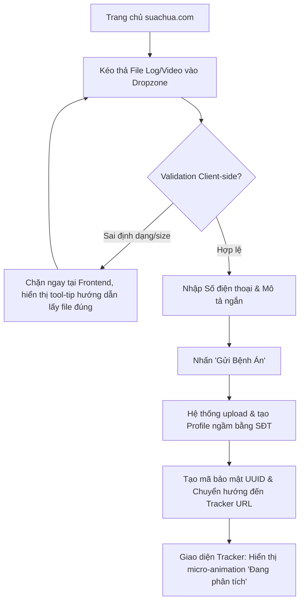
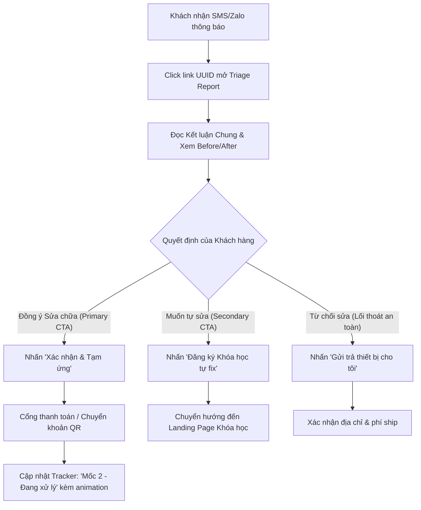

# UX Design Specification suachua

**Author:** ThanhTu
**Date:** 2026-05-02

---

<!-- UX design content will be appended sequentially through collaborative workflow steps -->

## Executive Summary

### Project Vision

suachua là một dịch vụ "Report-first UAV clinic" và phòng lab thực hành dành cho người dùng drone. Thay vì cạnh tranh trực diện mảng quay chụp, dự án tập trung giải quyết nỗi đau kỹ thuật bằng quy trình chẩn đoán minh bạch. Mỗi ca sửa chữa sẽ tạo ra case study, tài liệu học tập, và đóng vai trò như một phễu chuyển đổi tự nhiên sang các dịch vụ đào tạo thực hành chuyên sâu (ArduPilot, Betaflight, WebODM).

### Target Users

1. Khách hàng sửa chữa/cấu hình: Người chơi FPV, người tự ráp drone, chủ drone gặp lỗi cấu hình cần chẩn đoán minh bạch.
2. Học viên: Sinh viên kỹ thuật, giáo viên STEM, người muốn học kỹ năng vận hành, đọc log và xử lý sự cố.
3. Khách hàng dịch vụ dữ liệu (Entry-level): Cá nhân, nhóm nhỏ cần bản đồ/3D demo chi phí hợp lý.

### Key Design Challenges

- Đơn giản hóa dữ liệu kỹ thuật phức tạp: Cần trình bày các lỗi firmware, log bay hay thông số PID thành một "báo cáo bệnh án" trực quan để người dùng phổ thông cũng hiểu được rủi ro và ra quyết định.
- Quy trình Intake (Tiếp nhận) mượt mà: Form upload không yêu cầu đăng nhập trước, cho phép kéo thả nhanh file log và video lỗi, tối thiểu hóa ma sát.
- Luồng Upsell tinh tế: Chuyển đổi khéo léo từ việc khách xem Báo cáo chẩn đoán sang việc mua dịch vụ Sửa chữa chuyên sâu hoặc Khóa học thực hành.

### Design Opportunities

1. Visual Diagnostic Dashboard: Giao diện cá nhân hóa để khách hàng theo dõi tiến độ sửa chữa theo timeline thời gian thực và đọc báo cáo đính kèm media.
2. Smart "How it Works" Flow: Thiết kế quy trình 4 bước trực quan trên trang chủ nhằm giảm thiểu sự lo âu của khách khi gửi thiết bị giá trị cao.
3. Failure Library Showcase: Thư viện mở lưu trữ các case study lỗi sử dụng layout 'Before & After' mang tính điện ảnh (tương phản màu sắc rõ rệt). Đây sẽ là "thỏi nam châm" thu hút người dùng và chứng minh năng lực kỹ thuật.
4. Diagnostic Upload Queue: Form tiếp nhận ổn định thay vì tự động phân tích metadata (để tránh lỗi kỹ thuật phức tạp cho MVP), thông báo rõ thời gian trả kết quả, mang lại trải nghiệm số hóa chuyên nghiệp.

## Core User Experience

### Defining Experience

Hành động cốt lõi (Core Action) và quan trọng nhất là việc khách hàng gửi thông tin lỗi (upload log/video) và nhận lại báo cáo chẩn đoán (Triage Report). Trải nghiệm này mang lại cảm giác 'giải tỏa lo âu', chuyển từ trạng thái hoang mang sang trạng thái an tâm và kiểm soát được tình hình.

### Platform Strategy

- Web-based (Mobile-first & Desktop-ready): Tối ưu mượt mà cho cả người dùng đang ở bãi bay (quay video bằng điện thoại) và người dùng ở nhà (trích xuất file log nặng bằng máy tính) mà không cần tải App.

### Effortless Interactions

- Upload không cần tài khoản: Kéo thả file log/video lỗi, nhập thông tin liên hệ và nhận kết quả. Hồ sơ người dùng được tạo ngầm.
- Theo dõi tiến độ trực quan: Timeline 4 bước rõ ràng (Đã nhận -> Đang chẩn đoán -> Đã có báo cáo -> Đang xử lý) thay thế cho email thông báo khô khan.

### Critical Success Moments

- Khoảnh khắc "Aha!": Khi khách hàng mở Báo cáo Chẩn đoán và ngay lập tức hiểu vấn đề nhờ giao diện đối chiếu trực quan (Before/After visual).
- Khoảnh khắc Chuyển đổi (Conversion): Khi khách hàng tự nguyện click "Gửi máy Sửa chữa" hoặc "Đăng ký Khóa thực hành" ngay trên trang báo cáo vì đã tin tưởng năng lực chuyên môn.

### Experience Principles

1. Zero-Friction Intake: Giải quyết "Job-to-be-done" của khách hàng trước, thủ tục đăng ký tính sau.
2. Visual Over Technical: Dịch ngôn ngữ máy móc thành ngôn ngữ thị giác mang tính điện ảnh.
3. Transparent Triage: Trung thực tuyệt đối về thời gian chờ, tình trạng thiết bị và chi phí.
4. Seamless Upsell: Biến việc bán chéo (dịch vụ sửa chữa, khóa học) thành bước giải quyết vấn đề tự nhiên tiếp theo.

## Desired Emotional Response

### Primary Emotional Goals

- Sự Giải tỏa (Relief): Giải quyết nỗi lo âu về việc máy hỏng mà không rõ nguyên nhân.
- Sự Tin tưởng (Trust): Xây dựng niềm tin thông qua năng lực kỹ thuật và sự minh bạch.
- Sự Trao quyền (Empowerment): Khách hàng có đủ thông tin để tự tin quyết định phương án xử lý.

### Emotional Journey Mapping

1. Khám phá (Discovery): Tò mò nhưng mang tâm lý phòng thủ.
2. Tiếp nhận (Intake): Tự tin và Nhẹ nhõm nhờ form nộp bệnh án không ma sát.
3. Chờ đợi (Waiting): An tâm nhờ thanh tiến trình minh bạch.
4. Nhận Báo cáo (Triage Report): Vỡ òa ("Aha!") và Sáng tỏ.
5. Chuyển đổi (Conversion): Quyết đoán và được tiếp thêm động lực để sửa/học.

### Micro-Emotions

- Sự Rõ ràng (Clarity) > Sự Bối rối (Confusion): Không nhồi nhét thông số kỹ thuật khô khan.
- Sự An toàn (Safety) > Sự Bất an (Anxiety): Vi-tương-tác mượt mà, phản hồi ngay lập tức khi upload thành công.
- Sự Thuộc về (Belonging) > Sự Xa lạ (Isolation): Tìm thấy sự đồng cảm trong Failure Library.

### Design Implications

- Màu sắc & Typography: Dùng tone màu vững chãi (Xanh dương, Trắng, Xanh lá) để tạo sự tin cậy. Tránh lạm dụng phong cách neon/gamer hầm hố.
- Giọng văn (Tone of Voice): Đồng cảm, chuyên nghiệp, giáo dục, không trịch thượng.
- UI Components: Dùng các khối thẻ (Cards) bo góc mềm mại để phân tách thông tin, tránh cảm giác ngợp text.

### Emotional Design Principles

- Đóng vai trò như một "người trị liệu công nghệ": Lắng nghe vấn đề dễ dàng và xoa dịu nỗi đau qua báo cáo chẩn đoán dễ hiểu.
- Mọi điểm chạm đều củng cố thông điệp: "Thiết bị của bạn đang ở trong tay chuyên gia thực thụ."

## UX Pattern Analysis & Inspiration

### Inspiring Products Analysis

1. DJI Support / RMA Portal: Timeline theo dõi trực quan, tuy nhiên luồng đăng ký bắt buộc còn cứng nhắc.
2. iFixit: Tiêu chuẩn vàng cho "Failure Library" nhờ cách dùng hình ảnh step-by-step, phân loại độ khó và văn phong giáo dục.
3. Apple Support App: Luồng Intake xuất sắc, chọn thiết bị/triệu chứng và nhận báo giá mà không gặp ma sát.

### Transferable UX Patterns

- Navigation Patterns: Sticky Call-to-Action giúp nút "Xác nhận Sửa chữa/Đăng ký Học" luôn ghim trên màn hình khi xem báo cáo dài.
- Interaction Patterns: Order Tracker Stepper (Thanh tiến trình 4 bước) tra cứu nhanh bằng SĐT + Mã Bill.
- Visual Patterns: Before/After Sliders dùng để so sánh biểu đồ log hoặc linh kiện gãy vỡ một cách trực quan.

### Anti-Patterns to Avoid

- The "Wall of Text": Ném raw log (CLI dump) vào khách hàng gây bối rối.
- Forced Registration: Bắt buộc tạo tài khoản trước khi nộp file bệnh án.
- The Black Box: Báo giá một cục không có breakdown minh bạch.

### Design Inspiration Strategy

- What to Adopt: Sự minh bạch và văn phong giáo dục của iFixit; Luồng tiếp nhận trơn tru của Apple Support.
- What to Adapt: Timeline của DJI nhưng bỏ yêu cầu đăng nhập, thay bằng tra cứu nhanh.
- What to Avoid: Giao diện hầm hố kiểu gamer, thay vào đó là sự sạch sẽ, tin cậy của một "Phòng khám" công nghệ.

## Design System Foundation

### 1.1 Design System Choice

Lựa chọn: Hệ thống tùy biến (Themeable System) - Cụ thể: Shadcn/ui kết hợp với Tailwind CSS.
(Ghi chú: Shadcn/ui không phải là thư viện đóng gói cứng nhắc, mà là các component độc lập có thể thêm trực tiếp vào mã nguồn, được xây dựng trên nền tảng trợ năng Radix UI và styling bằng Tailwind).

### Rationale for Selection

- Cân bằng Tốc độ & Sự Độc bản: Cung cấp sẵn các component chuẩn (Forms, Stepper, Dialog), tiết kiệm hàng tuần code front-end nhưng vẫn cho phép tùy biến giao diện 100% để tạo ra bản sắc riêng.
- Thẩm mỹ Cao cấp: Ngôn ngữ thiết kế tối giản, sạch sẽ, hoàn toàn phù hợp với định vị "Phòng khám Công nghệ" (Tech Clinic) cao cấp của suachua.
- Kiểm soát Mã nguồn (Vendor Lock-in free): Mã nguồn Component nằm trực tiếp trong thư mục dự án. Team dev nắm toàn quyền kiểm soát logic, không lo phụ thuộc hay bị lỗi khi bên thứ ba cập nhật.

### Implementation Approach

- Xây dựng nền tảng Web bằng framework Next.js (hoặc React/Vite) kết hợp Tailwind CSS.
- **Tuân thủ Clean Architecture:** Tách biệt rõ ràng tầng UI (Shadcn components) khỏi tầng Business Logic. Các thao tác gọi API hoặc xử lý dữ liệu log phải được đưa vào các custom hooks hoặc services riêng biệt, không nhúng trực tiếp vào trong UI components.
- Kỷ luật MVP (Winston's Rule): Chỉ cài đặt (add) những component nào thực sự cần thiết. Tránh over-engineering làm phức tạp hóa hệ thống trong 90 ngày đầu tiên.
- Tập trung Giá trị Cốt lõi (John's Rule): Dành 80% công lực thiết kế và lập trình cho 2 chức năng trọng tâm: Form Tiếp nhận (Intake) và Timeline Tra cứu.

### Customization Strategy

- Design Tokens từ Ngày 1: Thống nhất bảng màu và định nghĩa ngay vào file `globals.css` từ lúc khởi tạo để tối ưu tốc độ lắp ráp component và hỗ trợ sẵn chế độ Dark/Light Mode.
- Color Palette: Deep Blue (Sự Tin cậy/Chuyên môn), Success Green (An toàn/Đã sửa xong), và Alert Orange/Red (Cảnh báo lỗi trong Báo cáo).
- Typography & Border Radius: Sử dụng font Sans-serif hiện đại, dễ đọc (Inter/Roboto). Các khối thông tin (Cards) và Nút bấm dùng góc bo tròn nhẹ (rounded-md hoặc rounded-lg) để tạo sự thân thiện, xoa dịu tâm lý phòng thủ của khách hàng.

## Detailed Defining Experience: The One-Minute UAV Intake

### User Mental Model

- Hiện trạng: Người dùng hoang mang, mang ra tiệm với tâm lý sợ bị "luộc đồ" hoặc "chém giá", hoặc phải đăng bài mỏi mòn trên các group Facebook chờ người giúp.
- Kỳ vọng mới: Muốn trải nghiệm giống như mang xe vào hãng bảo dưỡng: Có phiếu tiếp nhận điện tử, quy trình báo giá (Triage Report) minh bạch trước khi tiến hành sửa chữa.

### Success Criteria

- Tốc độ: Thời gian nộp bệnh án (Time-to-submit) hoàn tất dưới 60 giây.
- Không rào cản: Tỷ lệ thoát (Bounce rate) ở bước tải file gần như 0% (nhờ loại bỏ bước đăng ký).
- Sự chủ động: Khách hàng chủ động kiểm tra trang Tracker để xem tiến độ thay vì nhắn tin giục kỹ thuật viên.

### Novel UX Patterns

- Pizza Tracker cho Drone: Áp dụng mô hình theo dõi đơn hàng của thương mại điện tử vào quy trình sửa chữa thiết bị kỹ thuật phức tạp.
- Before/After Triage: Trả về báo cáo trực quan so sánh tình trạng "Hiện tại" và dự kiến "Sau khi sửa/tune" thay vì mã lệnh CLI thô.

### Experience Mechanics

1. Initiation: Khu vực Drop-zone nổi bật giữa trang chủ: "Kéo thả file log / video lỗi của bạn vào đây để chẩn đoán ngay".
2. Interaction: Kéo thả file -> Điền Số điện thoại & Mô tả ngắn -> Nhấn "Gửi Bệnh án".
3. Feedback: Hiệu ứng upload mượt mà bằng Progress bar. Khi thành công, tick xanh hiện ra: "Dữ liệu đã được gửi tới Kỹ thuật viên".
4. Completion: Tự động chuyển hướng sang trang Tracker URL (`suachua.com/track/ABC12345`). Thanh tiến trình hiển thị: "Mốc 1: Đã tiếp nhận - Đang phân tích dữ liệu".

## Visual Design Foundation

### Color System

- Primary Brand: Deep Tech Blue (dải màu Slate `#0F172A` hoặc Blue `#1E3A8A`). Tượng trưng cho sự tin cậy và chuyên nghiệp.
- Backgrounds: Trắng/Xám nhạt (Light mode) tạo cảm giác sạch sẽ như phòng lab. Slate/Dark Navy (Dark mode) êm dịu cho người dùng chuyên sâu.
- Semantic Colors:
  - Success (Xanh Lục - Emerald): Dành cho trạng thái "Đã sửa xong", "Hoàn tất".
  - Warning (Cam - Amber): Dành cho "Cảnh báo nhẹ", "Đang chờ linh kiện".
  - Error/Alert (Đỏ - Rose/Red): Khoanh vùng "Lỗi phần cứng nghiêm trọng".

### Typography System

- Primary Typeface: `Inter` hoặc `Geist Sans`. Tối ưu hóa cho UI, giúp các văn bản chẩn đoán sắc nét và dễ đọc.
- Monospace Typeface: `JetBrains Mono` hoặc `Geist Mono`. Sử dụng ĐỘC QUYỀN cho thông số kỹ thuật (PID rates), mã lỗi, log thô để tách biệt khỏi văn bản thường.
- Hierarchy: Phân cấp rõ ràng giữa Tiêu đề (In đậm, to) và Nội dung (Mỏng hơn, màu xám nhẹ) để tránh cảm giác bị "ngợp".

### Spacing & Layout Foundation

- Base Unit: Hệ thống lưới 8px (tiêu chuẩn của Tailwind CSS).
- Layout Principle: "Airy and Spacious" (Thoáng đãng và Rộng rãi). Sử dụng nhiều khoảng trắng (padding lớn) giữa các thẻ (Cards) để mắt người dùng được nghỉ ngơi khi xem dữ liệu kỹ thuật.
- Border Radius: `rounded-lg` (khoảng 8px). Đủ bo tròn để tạo sự thân thiện nhưng không mất đi sự nghiêm túc.

### Accessibility Considerations

- Contrast Ratio: Đảm bảo văn bản trên mọi nền đều đạt chuẩn WCAG AA, đặc biệt là các con số báo cáo chi phí.
- Beyond Color: Khi báo lỗi, bắt buộc phải đi kèm Icon (Ví dụ: ⚠️) để hỗ trợ người mù màu hoặc khi xem dưới trời nắng gắt.

## Design Direction Decision

### Design Directions Explored

- Direction 1: The "Clinical Lab" (Light Mode mặc định) - Giao diện sáng, sạch sẽ, sử dụng nhiều khoảng trắng. Tập trung tối đa vào sự minh bạch, biến báo cáo kỹ thuật thành một "đơn thuốc" thân thiện, dễ đọc cho người dùng phổ thông.
- Direction 2: The "Pro Engineering" (Dark Mode) - Giao diện tối, sử dụng màu Accent Emerald/Blue nổi bật trên nền đen. Tập trung vào dữ liệu kỹ thuật, làm nổi bật font Monospace. Lý tưởng để soi log bay và biểu đồ Blackbox mà không mỏi mắt.

### Chosen Direction

Dựa trên mục tiêu xây dựng "Phòng khám Công nghệ", hướng tiếp cận được chọn là sự kết hợp (Hybrid):
**The "Clinical Lab" làm nền tảng cốt lõi (Mặc định cho trang chủ và luồng Intake), kết hợp song song với "Pro Engineering" (Dark Mode) cho các trang phân tích kỹ thuật chuyên sâu (Triage Report / Dashboard).**

### Design Rationale

- Việc dùng nền trắng sáng ngay từ lúc nộp bệnh án giúp phá bỏ rào cản "kỹ thuật khô khan". Nó tạo ra cảm giác của một dịch vụ khách hàng chuyên nghiệp, an toàn và minh bạch.
- Tính năng Dark Mode là yêu cầu thực dụng đối với khách hàng cốt lõi (dân chơi drone FPV) vốn có thói quen làm việc với màn hình CLI tối màu. Nó giúp giảm mỏi mắt khi phân tích dữ liệu dài.

### Implementation Approach

- Xây dựng giao diện với CSS Variables thông qua Tailwind CSS (cấu trúc của Shadcn/ui) để hỗ trợ toggle Light/Dark Mode mượt mà ở cấp độ hệ thống.
- Mặc định: Trang chủ (Landing Page) và Luồng Intake nộp bệnh án luôn hiển thị ở Light Mode để tối ưu hóa sự thân thiện cho người mới.
- Tùy biến: Trang Triage Report và Tracker có nút Toggle để người dùng chuyển sang Dark Mode khi muốn đọc log chi tiết.

## User Journey Flows

### 1. Luồng Tiếp nhận Bệnh án (The One-Minute Intake)

Luồng này tối ưu hóa tối đa sự tiện lợi, loại bỏ hoàn toàn ma sát từ việc đăng ký tài khoản. Đội ngũ Dev sẽ can thiệp từ sớm bằng Client-side validation để giữ hệ thống sạch sẽ.

*(Ghi chú Bảo mật: Nếu khách hàng vô tình đóng trình duyệt và mất link Tracker, hệ thống cung cấp luồng phụ: Nhập SĐT -> Nhận mã OTP qua Zalo/SMS -> Khôi phục link Tracker an toàn).*

### 2. Luồng Xem Báo cáo & Chuyển đổi (Diagnostic & Upsell Flow)

Báo cáo được thiết kế theo nguyên tắc "Progressive Disclosure". Giao diện ưu tiên hiển thị Kết luận & Chi phí để chốt sale (Primary CTA), trong khi các thông số kỹ thuật khô khan được ẩn gọn gàng.

### 3. Journey Patterns (Mẫu Hành trình Chung)

- Navigation Patterns: Sử dụng *Single-page progression* (chuyển trạng thái UI không cần tải lại toàn bộ trang) cho luồng Intake để tạo cảm giác tốc độ tức thì.
- Decision Patterns: Tại mọi điểm chốt sale, luôn thiết lập cấu trúc phân cấp thị giác rõ ràng: Lựa chọn mong muốn nhất (Primary Button - Nổi bật) > Bán chéo (Secondary Button - Đường viền) > Lối thoát an toàn (Text Link).
- Feedback Patterns: Mọi hành động submit đều phải có *Loading spinner*, sau đó là *Toast message* thành công. Các mốc Tracker phải có *Micro-animations* (ví dụ: icon nảy lên) để tạo sự phấn khích và an tâm.

### 4. Flow Optimization Principles (Nguyên tắc Tối ưu Luồng)

- Secure Accountless by Default: Giải quyết mâu thuẫn giữa "Tiện lợi" và "Bảo mật" bằng cách dùng Số điện thoại làm tài khoản ngầm, cấp link Tracker dạng mã ngẫu nhiên (UUID) chống nội suy, và bảo vệ bằng OTP khi cần khôi phục.
- Progressive Disclosure: Đập vào mắt khách hàng đầu tiên phải là Tình trạng lỗi và Báo giá. Mọi raw log bắt buộc phải ẩn trong một Accordion mang tên "Dành cho chuyên gia / Technical Details" để giảm tải nhận thức cho người mới.

## Component Strategy

### Design System Components (Từ Shadcn/ui)

Dựa trên kiến trúc Shadcn/ui, chúng ta sẽ cài đặt các component tiêu chuẩn sau để làm nền tảng:
- **Layout & Structure:** `Card` (Khung chứa báo cáo), `Accordion` (Cực kỳ quan trọng để giấu phần Raw Log kỹ thuật theo nguyên tắc Progressive Disclosure).
- **Forms & Inputs:** `Button`, `Input`, `Textarea`, `Label`.
- **Feedback:** `Toast` (Thông báo góc màn hình), `Progress` (Thanh tải file cơ bản), `Alert` (Hiển thị cảnh báo màu Đỏ/Cam).
- **Overlays:** `Dialog` (Dùng cho luồng popup nhập mã OTP khôi phục link).

### Custom Components (Tự phát triển)

**1. DropzoneUploader (Khu vực kéo thả file)**
- **Purpose:** Nơi khách hàng nộp bệnh án (log/video) mượt mà nhất.
- **States:** Default (Viền đứt nét) -> DragActive (Nền Xanh nhạt) -> Uploading (Progress bar đè lên) -> Success/Error.
- **Interaction & System Architecture:** 
  - Tích hợp `react-dropzone` để validate định dạng/dung lượng ngay tại Client-side.
  - **Critical Rule:** Bắt buộc sử dụng cơ chế **Pre-signed URL** (AWS S3 / Cloudflare R2). Frontend lấy link tạm và upload file *trực tiếp* lên server lưu trữ đám mây, bypass hoàn toàn Backend để tránh sập server khi khách nộp video 4K.

**2. PizzaTrackerTimeline (Thanh tiến trình sửa chữa)**
- **Purpose:** Hiển thị 4 mốc trạng thái trực quan để giải tỏa sự lo âu.
- **States:** Pending (Xám) -> Active (Xanh dương, có hiệu ứng *Pulse* thu hút ánh nhìn) -> Completed (Xanh lá).
- **Interaction & System Architecture:** Component này phải hoạt động như một "kẻ phản chiếu" chính xác State Machine từ Backend. Tích hợp cơ chế **Server-Sent Events (SSE) hoặc Smart Polling** để giao diện tự động nhảy mốc thời gian thực mà khách không cần F5 tải lại trang.

**3. BeforeAfterSlider (Thanh trượt so sánh Trước/Sau)**
- **Purpose:** Vũ khí chốt sale trên trang Triage Report, trực quan hóa tổn thất linh kiện hoặc biểu đồ nhiễu (dạng ảnh).
- **Anatomy Constraints:** Giới hạn MVP chỉ hỗ trợ so sánh dạng **Ảnh tĩnh (Image)** (vd: qua `react-compare-slider`), chưa làm slider cho dạng biểu đồ tương tác phức tạp.
- **Accessibility (a11y):** Bắt buộc thiết kế thêm một nút Toggle phụ (Dạng "Xem ảnh Trước / Sau") đi kèm bên dưới thanh trượt. Đây là phương án dự phòng (fallback) để đảm bảo chuẩn WCAG cho người dùng chỉ sử dụng bàn phím.

### Component Implementation Strategy

- **Quy tắc Lắp ráp (Atomic Design):** Xây dựng các Custom Component bằng cách lồng ghép các base component của Shadcn (ví dụ: `DropzoneUploader` bọc ngoài `Progress`).
- **Tối giản State Management:** KHÔNG dùng Redux. Sử dụng **Zustand** cho các State toàn cục nhẹ nhàng (ví dụ: Theme Mode), còn lại giữ state cục bộ tại Component (Local State).

### Implementation Roadmap (Ưu tiên MVP 90 ngày)

- **Phase 1 (Core Intake - Tuần 1-2):** Setup Shadcn Base + Xây dựng `DropzoneUploader` (Có tích hợp Pre-signed URL). *Mục tiêu: Luồng nộp file chạy hoàn hảo, an toàn.*
- **Phase 2 (Triage Engine - Tuần 3-4):** Xây dựng `PizzaTrackerTimeline` (Có SSE/Polling) và lắp ráp báo cáo bằng `Card`, `Accordion`. *Mục tiêu: Khách theo dõi được tiến độ, xem báo giá.*
- **Phase 3 (Visual Polish - Tuần 5-6):** Xây dựng `BeforeAfterSlider` (Có a11y) và bổ sung vi-tương-tác (Micro-animations). *Mục tiêu: Tối ưu trải nghiệm WOW để Upsell.*

## UX Consistency Patterns

### Button Hierarchy (Phân cấp Nút bấm)
**Nguyên tắc:** Tránh sự tê liệt quyết định (Decision Paralysis). Mỗi màn hình chỉ được phép có duy nhất MỘT nút Primary.
- **Primary Action (Thao tác chính):** Nút nền đặc (Solid fill), bo góc mềm mại, sử dụng màu Deep Blue (Cho luồng Tiếp nhận) hoặc Emerald Green (Cho luồng Chốt sale/Thanh toán). *Ví dụ: "Gửi Bệnh án", "Xác nhận Sửa chữa".*
- **Secondary Action (Bán chéo/Hỗ trợ):** Nút viền (Outline) hoặc Ghost (Không viền, đổi nền khi hover). *Ví dụ: "Học cách tự fix", "Xem chi tiết Log".*
- **Destructive/Escape Action (Thoát/Hủy an toàn):** Bắt buộc sử dụng định dạng **Text Link** gạch chân màu xám, nằm tách biệt ở vị trí ít nổi bật nhất. *Ví dụ: "Không sửa nữa, trả máy cho tôi".*

### Feedback Patterns (Mẫu Phản hồi)
**Nguyên tắc:** Mọi tương tác đều phải có phản hồi ngay lập tức (dưới 100ms) để xoa dịu sự nóng ruột của khách hàng gửi máy sửa.
- **Loading States:** Khi bấm nút Submit, nút bấm ngay lập tức chuyển sang trạng thái Disabled kèm Spinner xoay bên trong (Inline loading). *Tuyệt đối không block toàn bộ màn hình bằng một màn che loading (Blocking overlay).*
- **Success States:** Sử dụng Component Toast màu Xanh lá kèm icon Tick. **Quy tắc vàng:** Toast báo thành công phải đi kèm lời hứa về thời gian (SLA) (Ví dụ: *"Xác nhận thành công! KTV sẽ cập nhật Tracker trong vòng 24h"*). Riêng Tracker dùng Micro-animation khi chuyển mốc.
- **Error States:** Lỗi ở đâu, bôi đỏ viền ở đó (Inline Error) kèm dòng chữ giải thích cách khắc phục ngay bên dưới. Không dùng Alert box báo lỗi chung chung.

### Form Patterns (Mẫu Nhập liệu)
- **Label Placement:** Nhãn (Label) luôn nằm phía TRÊN thanh Input (Top-aligned) để tối ưu diện tích Mobile.
- **Input Masking & Live Validation:** Ô Số điện thoại (chìa khóa của luồng Accountless) bắt buộc tích hợp **Input Mask**. Khi khách gõ, form tự động định dạng (Ví dụ: `090 123 4567`) nhằm ngăn lỗi sai trước khi nó xảy ra. Khâu kiểm tra độ dài cuối cùng được thực hiện bằng `onBlur`.

### Navigation & Layout Patterns (Mẫu Điều hướng)
- **Smart Sticky CTA (Nút ghim thông minh):** Trang Triage Report rất dài. Trên giao diện Mobile, nút "Xác nhận Sửa chữa" được ghim ở mép dưới cùng. **Hành vi bắt buộc:** Nút này *không* hiện ra ngay từ đầu, mà chỉ trượt lên (slide-up) hiển thị *SAU KHI* khách hàng cuộn (scroll) qua thẻ Báo giá. Điều này ép người dùng phải hấp thụ thông tin giá trị trước khi ra quyết định.
- **Fluid Progression:** Quá trình chuyển từ Trang chủ -> Kéo thả File -> Chuyển sang màn Tracker URL phải sử dụng hiệu ứng mờ dần (Fade-in/out) của SPA, không để xảy ra hiện tượng chớp trắng trang.

## Responsive Design & Accessibility

### Responsive Strategy
- **Mobile-First (Ưu tiên Di động):** Luồng nộp bệnh án (Intake) và Giao diện Tracker phải được thiết kế tối ưu tuyệt đối cho màn hình dọc, dành riêng cho tệp khách hàng thao tác ngoài thực địa (bãi bay) với kết nối 4G. Mọi nút bấm phải to, văn bản có độ tương phản cực cao để dễ đọc ngoài trời nắng.
- **Desktop-Optimized (Tối ưu Máy tính):** Dành cho khách hàng "Hardcore" dùng máy tính đọc log. **Quy tắc Vàng (Layout Rule):** Nội dung báo cáo (Triage Report) KHÔNG ĐƯỢC kéo giãn 100% màn hình để tránh mỏi mắt. Khung đọc chữ sẽ được giới hạn bằng CSS (Ví dụ: `max-w-4xl`) và căn giữa. Phần không gian thừa hai bên sẽ được tận dụng làm Thanh điều hướng (Table of Contents) và Nút Chốt sale ghim cố định (Sticky Sidebar).

### Breakpoint Strategy
Sử dụng bộ Breakpoints tiêu chuẩn của Tailwind CSS:
- **Mobile (Mặc định):** Layout 1 cột, hiển thị Nút Chốt sale bám đáy (Bottom Sticky CTA).
- **Tablet (`md: 768px`):** Layout 2 cột linh hoạt.
- **Desktop (`lg: 1024px` trở lên):** Layout đọc tập trung (Max-width wrapper), đẩy các Action phụ ra 2 bên Sidebar.

### Accessibility Strategy (Chiến lược Trợ năng)
Mục tiêu toàn hệ thống đạt chuẩn **WCAG 2.1 Mức AA**:
- **Color Contrast (Độ tương phản):** Tương phản tối thiểu 4.5:1. Tuyệt đối không dùng màu xám nhạt trên nền trắng để ghi Báo giá hoặc Lỗi kỹ thuật.
- **Touch Targets (Vùng chạm):** Khu vực kéo thả file (Dropzone) và các nút bấm trên di động phải đạt vùng chạm tối thiểu `44x44px`.
- **Keyboard Navigation:** Mọi thành phần nâng cao như Accordion (ẩn/hiện log) hay Thanh trượt (Slider) bắt buộc thao tác được bằng phím `Tab` và `Enter`, kèm đầy đủ các thẻ `aria-label` dành cho công cụ đọc màn hình.

### Testing & Error Prevention Strategy (Quản trị Rủi ro Phần cứng & Mạng)
Đây là các quy tắc sống còn mà đội ngũ QA phải test nghiêm ngặt:
- **Crash Prevention (Chống văng trình duyệt iOS):** Trình duyệt trên điện thoại có giới hạn RAM rất thấp. Trên giao diện Mobile, Dropzone bắt buộc phải ghi rõ Cảnh báo dung lượng (Ví dụ: *"Giới hạn 500MB"*) và yêu cầu khách hàng **tự cắt ngắn đoạn video lỗi ngay trong thư viện ảnh của điện thoại** trước khi chọn tải lên.
- **Network Resilience (Chống rớt mạng 4G):** Để đối phó với mạng chập chờn ở bãi bay, luồng Upload bắt buộc triển khai công nghệ **Resumable Upload** (Tải có tiếp tục) thông qua S3 Multipart Upload. Tải lỗi ở đâu, tiếp tục ở đó, không bắt khách hàng chờ đợi lại từ 0%.
- **Performance:** Mục tiêu điểm tốc độ Google Lighthouse > 95 bằng cách nén ảnh tự động và Lazy load toàn bộ thư viện liên quan đến 3D/Biểu đồ.

### Implementation Guidelines
- Lập trình viên viết CSS theo nguyên lý Mobile-first tuyệt đối (viết cho Mobile trước, override `md:`, `lg:` sau).
- Bắt buộc dùng thẻ HTML ngữ nghĩa (`<main>`, `<article>`, `<aside>`) thay vì lạm dụng `
`.
- Hình ảnh linh kiện hỏng phải có thẻ `alt` mô tả (Ví dụ: `alt="ESC góc phải cháy đen"`).

